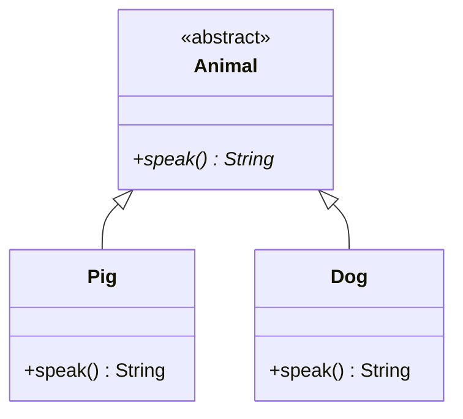

# [[Abstract Classes (Java)]]

**Context:** [[FIT2099_MOC]] · a base type you **never instantiate** · defines a common interface for [[Inheritance (Java)|subclasses]] and enables [[Polymorphism (Java)|polymorphism]]
**Task signature:** capture a shared concept (Animal, Assessment) that has no meaningful standalone object, and force subclasses to fill in the specifics.

> [!abstract] Quick Revision
> - **🎯 Trigger:** ask "will I ever instantiate this directly?" — if **no**, make it **abstract**; if **yes**, keep it concrete.
> - **⚡ Critical Bottleneck:** an **abstract method** has no body (`abstract int mark();` — no `{}`); any subclass that leaves even one abstract method unimplemented **must itself be abstract**.

## 🔧 Minimal Working Example
```java
abstract class Assessment {        // cannot be instantiated
    abstract int mark();           // abstract method: signature only, NO braces
}
class Test extends Assessment {
    @Override int mark() { return 100; }   // concrete: supplies the body
}

Assessment a = new Test();         // OK — polymorphism through the abstract base
// Assessment bad = new Assessment();   // COMPILE ERROR: Assessment is abstract
```
**Expected output:** `new Test()` compiles; `new Assessment()` is a compile error.

- **`abstract class`** ➔ marks a class that can be extended but **not** `new`-ed.
- **`abstract` method** ➔ declares the interface with **no implementation**; subclasses must override it.
- **Still has state** ➔ an abstract class **can** hold attributes and implemented methods — only the abstract methods lack bodies.

## 🔀 Variations
| | Concrete class | Abstract class |
| :--- | :--- | :--- |
| **`new` allowed?** | Yes | No (base only) |
| **Methods** | all implemented | mix of implemented + abstract (unimplemented) |
| **Attributes** | Yes | Yes |
| **Role** | actual objects | shared template / common interface |

- **UML** ➔ show an abstract class/method in *italics*, or tag the class `«abstract»`; generalisation arrow (hollow triangle) from subclass to it.
- **Rule** ➔ abstract methods can't be `private` (nothing could implement them); `static` methods and constructors can't be abstract.

## ⚙️ classDiagram

*(`*` marks `speak()` abstract; each concrete subclass supplies its own `speak()` — the basis for [[Polymorphism (Java)|polymorphic]] dispatch.)*

## 🥋 Kata 
> [!QUESTION]- Kata 1: `Person` should never be instantiated, but `Student` and `Lecturer` should. Model this. Give `Person` an abstract `role()` that each subclass implements.
> > [!SUCCESS]- Reference solution
> > ```java
> > abstract class Person {
> >     protected String name;
> >     Person(String name) { this.name = name; }
> >     abstract String role();               // no body
> > }
> > class Student extends Person {
> >     Student(String name) { super(name); }
> >     @Override String role() { return "Student"; }
> > }
> > ```
> > - **Key move:** `Person` is abstract (never a bare "person"); the abstract `role()` forces every subclass to declare its own.

## ⚠️ Pitfalls
- 💡 **Body on an abstract method** ➔ `abstract int mark() {}` is illegal — abstract methods have **no braces**; adding `{}` makes it concrete/empty.
- 💡 **Unimplemented method ⇒ still abstract** ➔ a subclass that skips any inherited abstract method won't compile unless it too is declared `abstract`.
- 💡 **`abstract` + `final` clash** ➔ illegal together — `final` blocks the extension that `abstract` requires.
