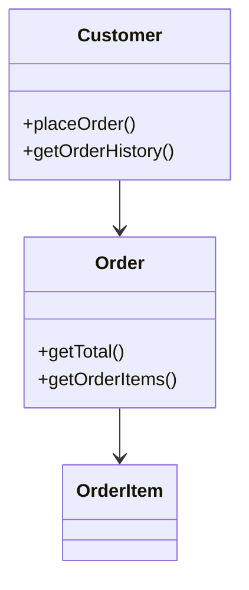

# [[CRC Cards (FIT2099)]]

**Context:** [[FIT2099_MOC]] · a lightweight, low-fidelity tool for **evolving an OO design** by working through [[Design Process and Techniques (FIT2099)|scenarios]] · one index card per class
**Task signature:** turn a domain scenario into candidate classes, their responsibilities, and who they collaborate with — spotting [[Single Responsibility Principle (Java)|SRP]] violations early.

> [!abstract] Quick Revision
> - **🎯 Trigger:** need to sketch classes and how they interact **before** committing to code/UML ➔ play "what-if" with **Class–Responsibility–Collaboration** cards.
> - **⚡ Critical Bottleneck:** if a card **won't fit / can't be rewritten succinctly**, the object is **doing too much** ➔ split it by **SRP**. Cards are great for *thinking*, poor for communicating to **outsiders**.

## 🃏 The card format
- **Three parts** (Ward Cunningham, who also invented the wiki) ➔ **Class name** (top) · **Responsibilities** (left: what it *knows* + what it *does*) · **Collaborators** (right: other classes it needs).
- **Collaborators = associations** ➔ a collaborator listed on a card becomes an **association/dependency** in the eventual [[UML Class Diagrams (Java)|class diagram]].

```text
┌─────────────────────────────────────┐
│ Customer                            │
├──────────────────────┬──────────────┤
│ places orders        │ Order        │
│ knows name           │              │
│ knows address        │              │
│ knows customer number │              │
│ knows order history  │              │
└──────────────────────┴──────────────┘
```

## ⚙️ collaborations become a classDiagram

*(Each card's Collaborators column maps to an outgoing association — CRC is a fast way to discover the arrows before drawing the diagram.)*

## 🎭 Using the cards
- **Start small** ➔ one or two obvious cards, then play **"what-if"** through a **scenario**; when the situation needs a new responsibility, **add it to an object** or **create a new object**; add **collaborations** as you go.
- **Role-play** ➔ different people **"play the object"**; messages become dialogue — *"Hey Unit, give me a list of students enrolled in you…"*; whoever holds that card acts it out; new responsibilities are added live.
- **Direction is free** ➔ neither strictly top-down nor bottom-up — design "**progresses from knowns to unknowns**" (Beck & Cunningham); two teams reached the same design from opposite ends.
- **Card too full ⇒ SRP** ➔ copy to a fresh card and state responsibilities more **abstractly**; if it *still* won't fit, the object **does too much** — **split it by responsibility** (SRP).

## 🥋 Kata
> [!QUESTION]- Kata 1: A `Seminar` card's Responsibilities list grows to: name, number, fees, waiting list, enrolled students, instructor, add student, drop student, compute average mark, print transcript. What's the smell and the fix?
> > [!SUCCESS]- Reference solution
> > - **Smell:** the card is overloaded — `Seminar` is trying to do enrolment *and* assessment/reporting ➔ **SRP** violation (a [[Design Smells (Java)|God Class]] in the making).
> > - **Fix:** split responsibilities onto collaborators — an **Enrollment** card (marks, average, final grade) and a **Transcript** card (determine average mark) — leaving `Seminar` with roster/registration only.
> > - **Key move:** "can't rewrite the card succinctly" is the CRC signal to **Extract Class**.

## ⚠️ Pitfalls
- 💡 **Not for outsiders** ➔ finished cards handed to a client as documentation were **unintelligible out of context**; CRC aids *designers'* thinking (XP even de-emphasises diagrams), not stakeholder communication.
- 💡 **No guarantee of good design** ➔ CRC encourages **small objects with clear responsibilities** (helps **encapsulation** and low connascence) but **doesn't guarantee** quality — always keep the [[SOLID Principles (Java)|design principles]] in mind.
- 💡 **Special notation optional** ➔ you don't *need* the card notation; it's a teaching/thinking aid, not a formal deliverable.
