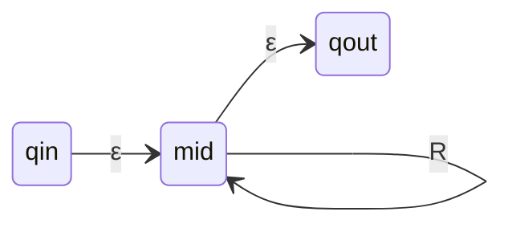

# [[Converting Regular Expressions to NFA]]

**Context:** [[FIT2014_MOC]] · leg 1 of the [[Kleene's Theorem]] cycle · **Assignment 1 hand skill**
**Task signature:** given a regular expression, build an NFA recognising the same language.

> [!abstract] Quick Revision
> - **🎯 Trigger:** a regex to turn into a machine ➔ start with **one edge** labelled the whole expression, then **rewrite edges** until every label is a **single letter or $\varepsilon$**.
> - **⚡ Critical Bottleneck:** the $R^{*}$ rule needs **two $\varepsilon$-transitions and a fresh middle state** — putting the $R$-loop on the left or right node is wrong in general.

## 🔧 The procedure
**Start with:** a Start state and a Final state joined by a single edge labelled with the **entire** regular expression.
**Repeat:** apply the rewrite rules below until **every edge is labelled by a letter or $\varepsilon$**.

| Edge label | Rewrite to |
| :--- | :--- |
| $\emptyset$ | **delete the edge** (no transition at all) |
| $(R)$ | a single edge labelled $R$ (brackets are only grouping) |
| $RS$ | two edges in series through a **new intermediate state**: $\bullet\xrightarrow{R}\circ\xrightarrow{S}\bullet$ |
| $R\cup S$ | **two parallel edges** between the same pair, labelled $R$ and $S$ |
| $R^{*}$ | $\bullet\xrightarrow{\varepsilon}\circ\xrightarrow{\varepsilon}\bullet$ with a **self-loop labelled $R$ on the new middle state** |

## ⭐ Why $R^{*}$ needs both $\varepsilon$-transitions

- **The danger** ➔ if the $R$-loop were placed on the **left** node, any other edge arriving there (say $P$ or $Q$) could enter the loop, letting the machine match $PR^{*}Q$ — strings the original expression never described. Symmetrically for the right node with $S$, $T$.
- **The fix** ➔ the fresh middle state is reachable **only** via the two $\varepsilon$-edges, so the loop is sealed off from the surrounding structure.
- **Rule of thumb** ➔ **never attach a star-loop to a node that has other traffic.**

## 📐 Worked example — $\mathtt{a}((\mathtt{ab})^{*}\cup(\mathtt{ba}))\mathtt{b}^{*}$
| Stage | Edge labels present | Rule applied |
| :--- | :--- | :--- |
| 0 | $\mathtt{a}((\mathtt{ab})^{*}\cup(\mathtt{ba}))\mathtt{b}^{*}$ | — |
| 1 | $\mathtt{a}$ · $(\mathtt{ab})^{*}\cup(\mathtt{ba})$ · $\mathtt{b}^{*}$ | concatenation (twice) |
| 2 | $\mathtt{a}$ · $(\mathtt{ab})^{*}$ ∥ $\mathtt{ba}$ · $\mathtt{b}^{*}$ | union ⟹ parallel edges |
| 3 | $\mathtt{a}$ · $(\mathtt{ab})^{*}$ · $\mathtt{b},\mathtt{a}$ · $\mathtt{b}^{*}$ | concatenation on $\mathtt{ba}$ |
| 4 | star rules on $(\mathtt{ab})^{*}$ and $\mathtt{b}^{*}$ | each ⟹ $\varepsilon$, middle state + loop |
| 5 | $\mathtt{a}$ · $\mathtt{b}$ · $\varepsilon$ only | split the $\mathtt{ab}$ loop by concatenation |

- **Order is free** ➔ any rule may be applied to any eligible edge; the resulting NFAs differ in shape but all recognise the same language.

## 🥋 Kata
> [!QUESTION]- Kata: Convert $\mathtt{a}(\mathtt{aa}\cup\mathtt{bb})^{*}\mathtt{b}$ into an NFA with only letter/$\varepsilon$ labels.
> > [!SUCCESS]- Reference solution
> > 1. **Concatenation** ⟹ three edges in series: $\mathtt{a}$, then $(\mathtt{aa}\cup\mathtt{bb})^{*}$, then $\mathtt{b}$.
> > 2. **Star** on the middle edge ⟹ $\varepsilon$ into a **fresh** state, a self-loop labelled $\mathtt{aa}\cup\mathtt{bb}$, $\varepsilon$ out.
> > 3. **Union** on the loop ⟹ two parallel loops labelled $\mathtt{aa}$ and $\mathtt{bb}$.
> > 4. **Concatenation** on each ⟹ $\mathtt{a}\!\cdot\!\mathtt{a}$ and $\mathtt{b}\!\cdot\!\mathtt{b}$ through new middle states.
> > - **Key move:** apply **star before union** here, so the two $\varepsilon$-edges seal the loop before it is split into branches.

## ⚠️ Pitfalls
- 💡 **$\emptyset$ deletes, it does not become a state** ➔ an edge labelled $\emptyset$ is removable because no string matches it.
- 💡 **Don't skip the middle state for $R^{*}$** ➔ attaching the loop directly to an existing node lets neighbouring edges leak into the loop.
- 💡 **Union means parallel, not sequential** ➔ $R\cup S$ becomes two edges **between the same pair** of states; chaining them would encode $RS$.
- 💡 **Stop only when every label is a letter or $\varepsilon$** ➔ a leftover multi-letter label like $\mathtt{ab}$ means the conversion is unfinished.

## 🧠 Active Recall
> [!FAQ]- Why does the $R^{*}$ rule introduce a new state and two $\varepsilon$-transitions rather than looping on an existing node?
> > [!SUCCESS]- Answer
> > - **Direct Criterion:** an existing node may have **other incoming or outgoing edges** ($P,Q$ on the left; $S,T$ on the right). A loop attached there could be entered from those edges, so the machine would accept strings like $PR^{*}Q$ that the original expression does not describe.
> > - **Technical Justification:** **Isolation of the loop** ➔ the fresh middle state is reachable only through the two $\varepsilon$-edges, guaranteeing that repetitions of $R$ occur exactly where the star sits in the expression.
