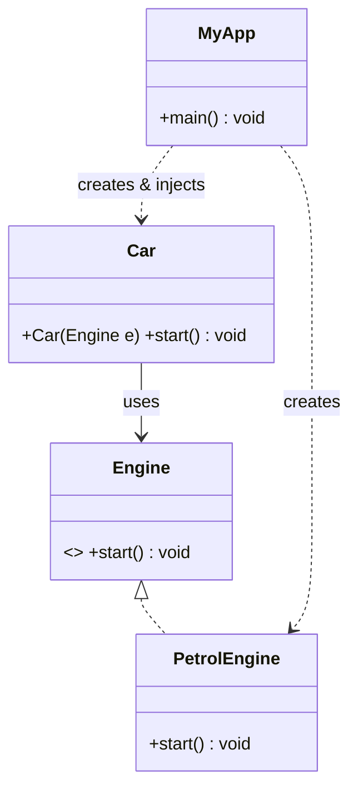

# [[Dependency Injection (Java)]]

**Context:** [[FIT2099_MOC]] · the technique that *implements* [[Dependency Inversion Principle (Java)|DIP]] · a class is **given** its collaborators instead of `new`-ing them · enables swapping and testing
**Task signature:** a class that hard-codes `new ConcreteService()` — hand the service in from outside so the class depends only on the abstraction.

> [!abstract] Quick Revision
> - **🎯 Trigger:** a class constructs its own dependency with **new** (even a concrete subclass of an interface) ➔ inject the dependency from an external **injector**.
> - **⚡ Critical Bottleneck:** DIP alone still leaves the client **creating** the concrete service (`this.mt = new MoodleMessager()`) — DI removes even that by having an outside class supply it.

## 🔧 Minimal Working Example
```java
// WITHOUT DI: Car constructs its own dependency — locked to PetrolEngine
class Car {
    private Engine engine = new PetrolEngine();   // hard-wired
    public void start() { engine.start(); }
}

// WITH DI (constructor injection): the engine is supplied
class Car {
    private final Engine engine;                  // abstraction
    public Car(Engine engine) { this.engine = engine; }   // injected
    public void start() { engine.start(); }
}
class MyApp {                                     // the INJECTOR
    public static void main(String[] args) {
        Engine engine = new PetrolEngine();       // chosen here, not inside Car
        Car car = new Car(engine);
        car.start();
    }
}
```
**Expected output:** `Car` works with **any** `Engine`; swapping to `ElectricEngine` needs no edit to `Car`.

- **Terminology** ➔ **client** (uses the interface, e.g. `Car`) · **service** (injected concrete, `PetrolEngine`) · **interface** (`Engine`) · **injector** (external class that supplies the service).
- **DI vs DIP** ➔ DIP = *depend on abstractions*; DI = *the abstraction is handed in by someone else*, so the client doesn't even know the concrete type.
- **Benefits** ➔ reusability, easy refactoring, and (biggest) **testability**.

## 🔀 Variations — three injection types
| Type | Mechanism | Trade-off |
| :--- | :--- | :--- |
| **Constructor** | service passed to the constructor | injector must be whoever builds the client; can be `final` |
| **Setter** | injector calls a public `setX(service)` | swap service on a **running** client; needs a public setter (weakens hiding) |
| **Interface** | client implements `InjectX` with `injectX(service)` | like setter, but you name the method / aren't limited to one |

- **Connascence of execution** ➔ with setter/interface injection the object **isn't usable until** `setX()` is called — an ordering dependency to watch.

## ⚙️ classDiagram


## 🥋 Kata
> [!QUESTION]- Kata 1: A `WeatherApp` `new`s a real `HttpApi` internally, so tests hit the network. Use constructor injection so a test can pass a mock.
> > [!SUCCESS]- Reference solution
> > ```java
> > interface WeatherSource { String forecast(); }
> > class HttpApi implements WeatherSource { public String forecast() { /* network */ return "sunny"; } }
> > class WeatherApp {
> >     private final WeatherSource source;
> >     WeatherApp(WeatherSource source) { this.source = source; }   // injected
> >     String report() { return "Today: " + source.forecast(); }
> > }
> > // test:
> > WeatherApp app = new WeatherApp(() -> "MOCK");   // mock supplies canned data, no network
> > ```
> > - **Key move:** inject the abstraction so a **mock** (stub returning preprogrammed responses) replaces the slow/unavailable real service in tests.

## ⚠️ Pitfalls
- 💡 **DI ≠ DIP** ➔ DIP is the *principle* (depend on abstractions); DI is the *technique* (an injector supplies them) — a class can obey DIP yet still `new` its service (not DI).
- 💡 **Setter injection leaks state** ➔ a public setter needed for injection also lets any caller mutate the service — a mild information-hiding cost.
- 💡 **Frameworks do this for you** ➔ Spring / Guice supply the injector (and manage persistence, REST, web wiring) — everywhere in industry, beyond this unit's scope.
