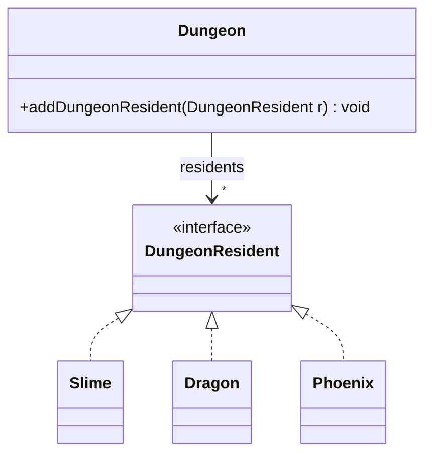

# [[Dependency Inversion Principle (Java)]]

**Context:** [[SOLID Principles (Java)|SOLID]] · the **D** · high- and low-level code both depend on an [[Interfaces (Java)|abstraction]] · the standard fix for [[SOLID Principles (Java)|downcasting/`instanceof`]] smells · realised in practice by [[Dependency Injection (Java)|dependency injection]]
**Task signature:** a high-level class wired to several concrete types — invert it so it depends only on an interface.

> [!abstract] Quick Revision
> - **🎯 Trigger:** a concrete class holds/creates other **concrete** classes ➔ introduce an abstraction both sides depend on.
> - **⚡ Critical Bottleneck:** *high-level modules should not depend on low-level modules; both depend on abstractions* — and abstractions must not depend on details.

## 🔧 Minimal Working Example
```java
// SMELL: Dungeon depends on three concrete enemy types (and breaks OCP when Phoenix is added)
public class Dungeon {
    private ArrayList<Slime> slimes = new ArrayList<>();
    private ArrayList<Undead> undeads = new ArrayList<>();
    private ArrayList<Dragon> dragons = new ArrayList<>();
    public void addSlime(Slime s) { slimes.add(s); }
    // ...addUndead, addDragon
}

// FIX: depend on an abstraction
public interface DungeonResident {}
public class Dragon implements DungeonResident {}
public class Slime  implements DungeonResident {}

public class Dungeon {
    private ArrayList<DungeonResident> residents = new ArrayList<>();
    public void addDungeonResident(DungeonResident r) { residents.add(r); }  // one list, one method
}
```
**Expected output:** adding `Phoenix implements DungeonResident` needs **no change** to `Dungeon` — DIP restores OCP too.

- **Inversion** ➔ top-down design naturally makes high-level code call low-level code; DIP **flips** that so both point at an interface.
- **Insulation** ➔ as long as the interface is stable, low-level changes don't ripple up and high-level changes don't ripple down.
- **The "any tool" test** ➔ a robot that "cuts with any tool given to it" (interface) beats one hard-wired to a "pizza-cutter arm" (concrete).
- **Hinge point** ➔ inverting one relationship gives `ClientCode → «abstract»Interface ← Implementation`: client and implementation can each change freely **as long as both respect the interface** — the design bends only at the "hinge", constrained as lightly as possible.

> [!NOTE] **DIP vs DI:** DIP makes the client depend on the interface, but the client (or DIP alone) often still **creates** the concrete implementation. [[Dependency Injection (Java)|Dependency injection]] removes that last coupling by having an external *injector* supply the concrete service.

## ⚙️ classDiagram


## 🥋 Kata
> [!QUESTION]- Kata 1: A `Report` class `new`s a `MySQLDatabase` directly to save. Invert the dependency so it works with any store.
> > [!SUCCESS]- Reference solution
> > ```java
> > interface DataStore { void save(String data); }
> > class MySQLDatabase implements DataStore { public void save(String d) { /* ... */ } }
> > class Report {
> >     private DataStore store;                 // depends on abstraction
> >     Report(DataStore store) { this.store = store; }   // injected, not new-ed
> >     void persist(String d) { store.save(d); }
> > }
> > ```
> > - **Key move:** hold the **interface** and receive the concrete via the constructor — swap `FileStore` in with no edit to `Report`.

## ⚠️ Pitfalls
- 💡 **Concrete-typed fields/params** ➔ referencing `Slime`/`MySQLDatabase` directly in a high-level class is the DIP smell; use the interface type.
- 💡 **DIP rescues OCP** ➔ depending on an abstraction is usually what makes a class closed-for-modification yet open-for-extension.
- 💡 **Don't invert everything** ➔ an interface for a stable, single implementation adds indirection with no payoff; invert where the low-level detail actually varies.
