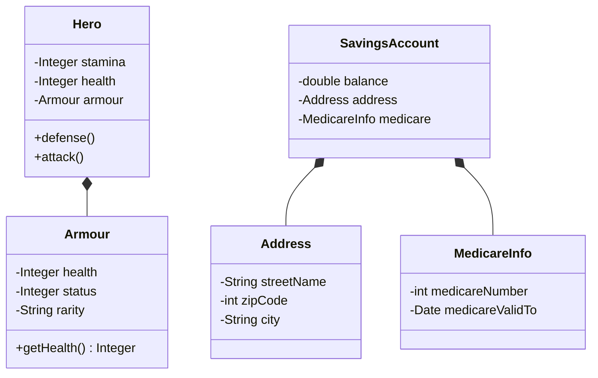

# [[Design Smells (Java)]]

**Context:** [[FIT2099_MOC]] · a **catalogue** of surface indicators (Fowler) that a design has a deeper problem · the *diagnosis* layer that [[Refactoring (Java)|refactoring]] then treats · leans on [[SOLID Principles (Java)|SOLID]], [[Polymorphism (Java)|polymorphism]] and composition
**Task signature:** given a smelly class/method, **name the smell** and **choose the refactoring step** that removes it.

> [!abstract] Quick Revision
> - **🎯 Trigger:** code that *works* but is **hard to read, change, or extend** ➔ identify the smell family, apply the matching refactoring.
> - **⚡ Critical Bottleneck:** smells are **subjective heuristics** ("might be wrong", vary by language) — a smell is a *hint to investigate*, **not proof** of a bug. Branching on **type information** (`instanceof`/`switch(type)`) is the single most exam-relevant smell ➔ its fix is almost always **Replace Conditional with Polymorphism**.

## 📝 What a smell is
- **Code smell (Fowler)** ➔ a **surface symptom** in the source that usually corresponds to a deeper design weakness; "if it stinks, change it."
- **Subjective + contextual** ➔ Fowler's taxonomy is a *guide*, admits it "might be wrong"; something smelly in Java may be fine in C#. **Experienced programmers know what stinks.**
- **Smell ≠ failing code** ➔ the program runs; the cost is **maintainability** (understanding, changing, extending), not correctness.

## 🧭 The smell families (with fix)
| Family | Smell | Symptom | Refactoring step |
| :--- | :--- | :--- | :--- |
| **Bloaters** | Long Method | method too long to grasp | **Extract Method**; Decompose Conditional; Replace Method with Method Object |
| **Bloaters** | Large / God Class | "catch-all" class, likely breaks [[Single Responsibility Principle (Java)|SRP]] | **Extract Class** / Extract Subclass / Extract Interface |
| **Bloaters** | Long Parameter List | $>3$ args to a method | pass the **object itself**; **Introduce Parameter Object** |
| **Bloaters** | Data Clumps | same group of fields recurs everywhere | **Extract Class** / Introduce Parameter Object |
| **Change Preventers** | Divergent Change | *one* class changed for **many** unrelated reasons | **Extract Class** to split it |
| **Change Preventers** | Shotgun Surgery | *one* change forces edits across **many** classes | **Move Method / Move Field** to consolidate; remove redundant classes |
| **Couplers** | Feature Envy | a method uses another object's data more than its own | **Move Method** (or Extract Method) to where the data lives |
| **Couplers** | Message Chains | `a.getB().getC().getD()` — client navigates the whole structure | **Hide Delegate**; move/extract to chain start |
| **Couplers** | Middle Man | class only delegates, does nothing itself | **Remove Middle Man** (the class shouldn't exist) |
| **Procedural** | Primitive Obsession | primitives/`String`s instead of classes; hard to validate | group primitives into **their own class**; Replace Array with Object |
| **Procedural** | Switch/Type Checking | `switch`/`if` cascade on a **type field**, repeated in many places | **Replace Conditional with Polymorphism** (or Replace Type Code with State/Strategy) |
| **Procedural** | Data Class | class with fields + getters/setters, **no behaviour** | encapsulate public fields; **Move Method** — put logic on the data |
| **Dispensables** | Duplicated Code | same code in several places (breaks **DRY**) | **Extract Method** / pull up / Form Template Method |
| **Overengineering** | Speculative Generality | machinery "for the future" that is never used | Collapse Hierarchy / Inline Class / remove unused params |
| **Overengineering** | Lazy Class | class that no longer earns its keep | **Inline Class** |

> [!NOTE] **Divergent Change vs Shotgun Surgery (classic exam trap):** they are **opposites**. Divergent Change = **one class, many reasons to change** (change is *contained but tangled*). Shotgun Surgery = **one reason, many classes to change** (change is *scattered*). Both are **Change Preventers**.

## 🔧 Worked examples (smell ➔ fix)

### 1. Data Clumps / Data Class ➔ Extract Class
```java
// SMELL: {year, month, day} clump repeats; DateUtil is a bloated procedural util
class DateUtil {
    boolean isAfter(int y1,int m1,int d1, int y2,int m2,int d2) { /*...*/ }
    int differenceInDays(int y1,int m1,int d1, int y2,int m2,int d2) { /*...*/ }
}
// FIX: extract a Date class; the clump becomes ONE parameter.
// Best: give Date the behaviour so it isn't a lifeless Data Class.
class Date {
    int year, month, day;
    boolean isAfter(Date other) { /*...*/ }          // logic lives WITH the data
    int differenceInDays(Date other) { /*...*/ }
}
```
**Expected output:** call sites read `d1.isAfter(d2)` not a 6-int soup; a class with only fields + no methods is a **Data Class** — push the operating logic onto it.

### 2. Type Checking ➔ Replace Conditional with Polymorphism
```java
// SMELL: switch on a type field — the same cascade will reappear elsewhere
class Pet {
    private String type;
    String makeSoundInSpanish() {
        switch (type) {
            case "cat": return "miau miau";
            case "dog": return "guau guau";
            default:    throw new IllegalStateException();
        }
    }
}
// FIX: one subclass per type; the language's dynamic dispatch IS the switch
abstract class Pet { abstract String makeSoundInSpanish(); }
class Cat extends Pet { String makeSoundInSpanish() { return "miau miau"; } }
class Dog extends Pet { String makeSoundInSpanish() { return "guau guau"; } }
```
**Expected output:** adding a `Bird` = one new subclass, **no existing method edited** ([[Open-Closed Principle (Java)|OCP]]); the `instanceof`/`switch(type)` disappears. This is why "branching on type information is a code smell" — see [[Liskov Substitution Principle (Java)|LSP]].

### 3. Shotgun Surgery ➔ Extract Method (consolidate the rule)
```java
// SMELL: the same guard appears in withdraw(), transfer(), processFees()...
if (this.balance < MINIMUM_BALANCE) { this.notifyAccountHolder(); return; }
// FIX: one private query owns the rule; every method calls it
private boolean isAccountUnderMinimum() { return this.balance < MINIMUM_BALANCE; }
// if (isAccountUnderMinimum()) { notifyAccountHolder(); return; }
```
**Expected output:** the threshold rule now changes in **one** place, not three — one reason, one edit.

## ⚙️ classDiagram (Divergent Change / Primitive Obsession ➔ composition)

*(Armour fields that always changed together are **Extracted** out of `Hero`; the `SavingsAccount` primitive soup is grouped into `Address` + `MedicareInfo`. Effect: ↓ **coupling** to raw fields, ↑ **cohesion** per class, ↑ **extensibility**.)*

## 🥋 Kata
> [!QUESTION]- Kata 1: A `Customer` builds a phone string with `mobilePhone.getAreaCode()+getPrefix()+getNumber()`. Name the smell and refactor it.
> > [!SUCCESS]- Reference solution
> > ```java
> > // SMELL: Feature Envy — Customer manipulates Phone's data in detail
> > class Phone {
> >     private final String thePhoneNumber;
> >     public String getAreaCode() { return thePhoneNumber.substring(0,3); }
> >     public String getPrefix()   { return thePhoneNumber.substring(3,6); }
> >     public String getNumber()   { return thePhoneNumber.substring(6,10); }
> >     public String toFormattedString() {              // MOVE the logic to the data
> >         return "(" + getAreaCode() + ") " + getPrefix() + "-" + getNumber();
> >     }
> > }
> > class Customer {
> >     private Phone mobilePhone;
> >     public String getMobilePhoneNumber() { return mobilePhone.toFormattedString(); }
> > }
> > ```
> > - **Key move:** **Feature Envy** ➔ **Move Method** — put formatting on `Phone` (it owns the data); `Customer` just delegates. Cuts coupling.

> [!QUESTION]- Kata 2: Name the smell and the fix — "whenever I add a payment type I edit `PriceCalculator`, `Receipt`, and `TaxReport`."
> > [!SUCCESS]- Reference solution
> > - **Smell:** **Shotgun Surgery** (one reason → many classes). *Not* Divergent Change (which is one class → many reasons).
> > - **Fix:** **Move Method / Move Field** to gather the payment-type behaviour into one place (ideally a polymorphic `PaymentType` hierarchy), so a new type touches one class.

## ⚠️ Pitfalls
- 💡 **Smell ≠ certainty** ➔ Fowler's list is subjective and language-dependent; treat a smell as "**investigate here**", never as an automatic rewrite trigger — over-reacting causes Speculative Generality.
- 💡 **Divergent Change ⇄ Shotgun Surgery mix-up** ➔ remember: Divergent = *one class, many reasons*; Shotgun = *one reason, many classes*. Getting the direction wrong loses the mark.
- 💡 **Type-branching is the flagged smell** ➔ `switch(type)` / `instanceof` cascades ➔ **Replace Conditional with Polymorphism**; leaving them breaks OCP and duplicates the cascade.
- 💡 **Data Class vs good encapsulation** ➔ a pure field-bag with getters/setters is a *smell*, not automatically fine — the goal is behaviour **with** the data, not anaemic structs manipulated by others.
