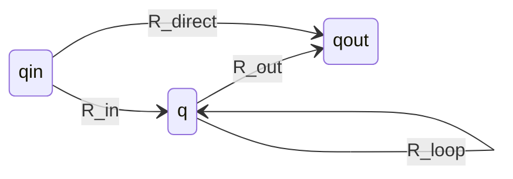

# [[FA to Regular Expression (GNFA State Elimination)]]

**Context:** [[FIT2014_MOC]] · legs 3–4 of the [[Kleene's Theorem]] cycle — the return journey from machine to expression · **Assignment 1 hand skill**
**Task signature:** given an FA/NFA, produce a regular expression describing exactly the language it recognises.

> [!abstract] Quick Revision
> - **🎯 Trigger:** an automaton to convert into a regex ➔ turn it into a **standard GNFA**, then **rip out one state at a time** until a single edge remains.
> - **⚡ Critical Bottleneck:** the elimination formula $R_{\text{direct}}\cup(R_{\text{in}}R_{\text{loop}}^{*}R_{\text{out}})$ must be applied to **every** ordered pair $(q_{\text{in}},q_{\text{out}})$ before the state is deleted — missing a pair loses strings.

## 📝 GNFA — the bridging model
- **Definition** ➔ a **Generalised NFA** is an NFA whose transitions may be labelled by **regular expressions**, not just single letters.
- **Acceptance** ➔ $w$ is accepted if it splits as $w=w_1w_2\cdots w_k$ along a Start-to-Final sequence of transitions labelled $R_1,\dots,R_k$ with each $w_i$ matching $R_i$.
- **Standard GNFA** ➔ one **Final** state, distinct from the Start state; the **Start state has no incoming** transitions; the **Final state has no outgoing** transitions.
  - *(Sipser additionally demands an arc between every pair of states, using $\emptyset$ where no transition should occur — "special form". Not needed for this algorithm, but it simplifies proofs.)*

## ⚙️ Step 1 — FA $\to$ standard GNFA
1. **Single Final state with incoming arcs only** ➔ if necessary add a **new** Final state and $\varepsilon$-transitions from each old Final state to it; the old ones stop being Final.
2. **Single Start state with outgoing arcs only** ➔ if necessary add a **new** Start state with an $\varepsilon$-transition to the old Start state; the old one stops being Start.
- **Letters are already regexes** ➔ every existing edge label is a valid one-letter regular expression, so nothing else changes.
- **Language preserved** ➔ the resulting GNFA accepts exactly the original language.

## ⚙️ Step 2 — GNFA $\to$ regular expression (state elimination)
**Repeat** until only the Start state, the Final state and one transition remain; that transition's label is the answer.

**Notation for the state $q$ being removed:**

| Symbol | Meaning |
| :--- | :--- |
| $q$ | the state being eliminated (neither Start nor Final) |
| $q_{\text{in}}$ | any **non-Final** state (a predecessor) |
| $q_{\text{out}}$ | any **non-Start** state (a successor) |
| $R_{\text{in}}$ | label on $q_{\text{in}}\to q$ |
| $R_{\text{loop}}$ | label on $q\to q$ (self-loop) |
| $R_{\text{out}}$ | label on $q\to q_{\text{out}}$ |
| $R_{\text{direct}}$ | existing label on $q_{\text{in}}\to q_{\text{out}}$ |

**The replacement rule** — the new label on $q_{\text{in}}\to q_{\text{out}}$ is
$$R_{\text{direct}}\;\cup\;\big(R_{\text{in}}\,R_{\text{loop}}^{*}\,R_{\text{out}}\big)$$

- **Reading the formula** ➔ either go **straight** from $q_{\text{in}}$ to $q_{\text{out}}$ ($R_{\text{direct}}$), **or** detour via $q$: enter with $R_{\text{in}}$, loop there any number of times ($R_{\text{loop}}^{*}$, possibly zero), then leave with $R_{\text{out}}$.
- **Do it for all pairs** ➔ apply the rule for **every** $q_{\text{in}}$ and every $q_{\text{out}}$, **then** delete $q$. The result is an equivalent GNFA with one fewer state.

## 📊 Worked elimination (4-state example)
Eliminating state 2 from a GNFA on states $1$ (Start), $2$, $3$, $4$ (Final):

| Pair rewritten | New label |
| :--- | :--- |
| $1\to3$ | $\mathtt{b}\cup(\mathtt{a}\mathtt{a}^{*}\mathtt{a})$ |
| $3\to3$ | $\mathtt{b}\cup(\mathtt{b}\mathtt{a}^{*}\mathtt{a})$ |
| $3\to4$ | $\varepsilon\cup(\mathtt{b}\mathtt{a}^{*}\mathtt{b})$ |
| $1\to4$ | $\mathtt{a}\cup(\mathtt{a}\mathtt{a}^{*}\mathtt{b})$ |

Then eliminating state 3 leaves the single Start-to-Final label:
$$\mathtt{a}\cup(\mathtt{a}\mathtt{a}^{*}\mathtt{b})\;\cup\;\Big(\big(\mathtt{b}\cup(\mathtt{a}\mathtt{a}^{*}\mathtt{a})\big)\big(\mathtt{b}\cup(\mathtt{b}\mathtt{a}^{*}\mathtt{a})\big)^{*}\big(\varepsilon\cup(\mathtt{b}\mathtt{a}^{*}\mathtt{b})\big)\Big)$$

- **Shape of the answer** ➔ each elimination round wraps the previous labels in one more $R_{\text{in}}R_{\text{loop}}^{*}R_{\text{out}}$ layer, which is why these expressions grow quickly and rarely look "simplified".

## 🥋 Kata (write from blank)
> [!QUESTION]- Kata: A GNFA has Start $S$, one middle state $q$ and Final $F$, with $S\xrightarrow{\mathtt{a}}q$, $q\xrightarrow{\mathtt{b}}q$, $q\xrightarrow{\mathtt{a}}F$, and no direct $S\to F$ edge. Eliminate $q$.
> > [!SUCCESS]- Reference solution
> > $R_{\text{direct}}=\emptyset$ (no edge), $R_{\text{in}}=\mathtt{a}$, $R_{\text{loop}}=\mathtt{b}$, $R_{\text{out}}=\mathtt{a}$:
> > $$\emptyset\cup(\mathtt{a}\,\mathtt{b}^{*}\,\mathtt{a})\;=\;\mathtt{a}\mathtt{b}^{*}\mathtt{a}$$
> > - **Key move:** a missing direct edge contributes $\emptyset$, and $\emptyset\cup R=R$ — so the union term simply disappears.

## ⚠️ Pitfalls
- 💡 **Eliminate every pair before deleting** ➔ the rule runs over **all** $(q_{\text{in}},q_{\text{out}})$ combinations, including $q_{\text{in}}=q_{\text{out}}$ (creating or extending a self-loop). Deleting early silently drops paths.
- 💡 **Never eliminate the Start or Final state** ➔ they are the endpoints; only intermediate states get ripped out.
- 💡 **$R_{\text{loop}}^{*}$ covers zero loops** ➔ the star already includes "pass straight through $q$", so don't add a separate case for it.
- 💡 **No direct edge means $\emptyset$, not $\varepsilon$** ➔ $\emptyset$ contributes nothing to the union; using $\varepsilon$ would wrongly accept skipping the segment entirely.
- 💡 **Expect ugly output** ➔ the expression is correct even if far from minimal; simplifying is a separate (optional) step.

## 🧠 Active Recall
> [!FAQ]- Explain each part of $R_{\text{direct}}\cup(R_{\text{in}}R_{\text{loop}}^{*}R_{\text{out}})$ and why it preserves the language.
> > [!SUCCESS]- Answer
> > - **Direct Criterion:** every path from $q_{\text{in}}$ to $q_{\text{out}}$ either **avoids** $q$ — captured by $R_{\text{direct}}$ — or **passes through** it: enter via $R_{\text{in}}$, take the self-loop any number of times ($R_{\text{loop}}^{*}$, including zero), and leave via $R_{\text{out}}$. The union covers both cases exhaustively.
> > - **Technical Justification:** **Path decomposition** ➔ since the two cases partition all $q_{\text{in}}\to q_{\text{out}}$ routes, replacing them with this single label leaves the accepted string set unchanged; applying it to every pair before deleting $q$ ensures no route is lost.

> [!FAQ]- Why must the FA first be converted into a *standard* GNFA?
> > [!SUCCESS]- Answer
> > - **Direct Criterion:** state elimination terminates in a machine with **one Start, one Final and one transition**. That is only well-defined if there is a **single** Final state distinct from the Start, with no incoming arcs to Start and no outgoing arcs from Final — otherwise the final surviving edge would not describe the whole language.
> > - **Technical Justification:** **Fresh endpoints via $\varepsilon$** ➔ adding a new Start (with $\varepsilon$ to the old one) and a new Final (with $\varepsilon$ from all old Finals) guarantees these properties **without changing the language**, since $\varepsilon$-moves consume no input.
