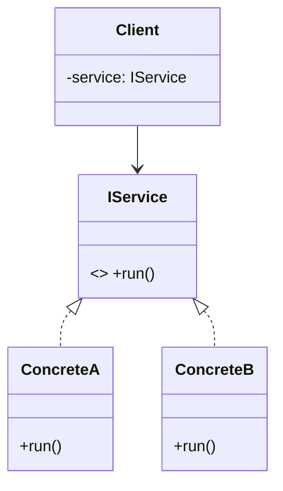

# [[FIT2099 Unit Cheatsheet]]

**Context:** [[FIT2099_MOC]] · the WHOLE unit in one re-read — design process → principles (SOLID + core three) → smells→refactors → contracts → UML. Java syntax lives in [[Java Toolkit (Cheatsheet)]], diagram syntax in [[UML Toolkit (Cheatsheet)]].

> [!abstract] Quick Revision
> - **🎯 Objective:** every design answer = decision + RATIONALE in Coupling / Cohesion / Extensibility terms — WHY, never a restated WHAT.
> - **⚡ Critical Bottleneck:** branching on type (`instanceof`/`switch(type)`) is THE exam smell; its fix is almost always Replace Conditional with Polymorphism.

## 1️⃣ Design Process & Rationale
- **Design's place** ➔ between requirements (WHAT) and implementation (the build); answers "HOW should we build it?"; phases overlap in practice — **Lean: decide as late as responsibly possible**, on fact not speculation.
- **Many valid solutions** ➔ design is creative; technique doesn't guarantee quality (practice does), and the audience is MANY stakeholders — it must communicate.
- **[[Design Rationale (FIT2099)]]** ➔ documents WHY per decision; describing the diagram/algorithm (HOW) belongs in Javadoc/sequence diagrams and wastes rationale marks.
- **CRC cards** ➔ what-if sketching before UML; a card that won't fit succinctly = object doing too much ⟹ split by SRP. Good for thinking, poor for outsiders.
- **[[Technical Debt (FIT2099)]]** ➔ fast-messy borrows against future changeability ("interest"); inevitable and not inherently bad — judged by whether taken deliberately and repaid by refactoring to a BETTER design.

## 2️⃣ Principles (trigger ➔ fix ➔ metric)
| Principle | Violation trigger | Fix | Wins in |
| :-- | :-- | :-- | :-- |
| **S**RP | class changes for different REASONS (not line count) | one responsibility per class | cohesion ↑ |
| **O**CP | adding a case means EDITING tested code | new behaviour = new subclass behind an abstract method | extensibility ↑ |
| **L**SP | substituting subclass changes behaviour / breaks caller | `T x = new S();` must never surprise — else wrong inheritance | correctness of polymorphism |
| **I**SP | implementing an interface leaves empty / throwing methods | split the fat interface; implement MANY small ones | coupling ↓ |
| **D**IP | concrete class holds/creates concrete classes | both sides depend on an abstraction | coupling ↓ |

- **SOLID = guidelines, not laws** ➔ over-applying breeds tiny-class complexity; apply where it reduces real dependency pain.
- **Core three** ➔ DRY · classes own their properties · avoid literal-itis — all three are "where does change land?": duplication, misplaced responsibility and buried literals force one change into many edits.
- **DI beyond DIP** ➔ DIP still lets the client `new` the concrete service; **Dependency Injection** moves creation to an external injector.

*The one shape behind OCP + DIP + polymorphism: client holds the abstraction; variants plug in beneath it.*

## 3️⃣ Smells ➔ Refactors
- **Smell status** ➔ subjective heuristics — a HINT to investigate, not proof of a bug.

| Smell | Refactor |
| :-- | :-- |
| type-branching (`instanceof`, `switch(type)`) | **Replace Conditional with Polymorphism** |
| repeated "which subclass?" construction | **Factory Method** — returns the PARENT type, decides internally; new subclass touches only the factory |
| magic numbers / string literals | **Enum** (compiler rejects invalid values) or named constant |
| getter leaks a mutable field (aliasing) | **Defensive copy** in/out — the alias IS the encapsulation breach |
| duplicated logic | extract method/class (DRY) |
| god class / card won't fit | split by SRP |

- **[[Refactoring (Java)]]** ➔ behaviour-preserving restructure — if outputs change it's a rewrite; automated unit tests make it safe (change → test → repeat).

## 4️⃣ Contracts & Correctness
- **[[Design by Contract (Java)]]** ➔ precondition = client's guarantee, postcondition = supplier's. **Blame rule:** broken precondition = CLIENT bug ⟹ throw exception; broken postcondition/invariant = SUPPLIER bug ⟹ assertion.
- **Exceptions vs assertions** ➔ exceptions = runtime/client errors, stay ON in production; assertions = developer bugs, disabled in shipped code.
- **Command-Query Separation** ➔ commands mutate, queries don't; a method doing both can't be safely called inside a contract check.
- **Encapsulation** ➔ private fields + a DELIBERATE public interface; NOT getter+setter for everything — read-only/write-only is often correct. Client couples to the supplier's INTERFACE, never internals.

## 5️⃣ OO Mechanics (the design-relevant core)
- **is-a vs has-a vs uses-a** ➔ inheritance (`extends`, ONE class) vs association (stored field) vs dependency (transient parameter/return) — the three arrows FIT2099 examines; aggregation/composition are read-only knowledge.
- **Interfaces** ➔ capability shared across unrelated classes; `implements` MANY — Java's multiple inheritance of TYPE, not state.
- **Abstract class** ➔ "will I ever instantiate this?" no ⟹ abstract; unimplemented abstract methods propagate abstractness.
- **Polymorphism** ➔ RUNTIME object type picks the override; the DECLARED type limits visible methods — subclass-only methods hidden behind a base reference.
- **UML** ➔ class diagram = static structure (arrow type IS the meaning) · sequence diagram = one narrow runtime scenario, **concrete classes only** (can't instantiate abstractions).

## ⚠️ Top Cross-Unit Traps
- 💡 **Rationale ≠ description** ➔ if the sentence works as a caption for the diagram, it earns zero rationale marks — argue coupling/cohesion/extensibility.
- 💡 **Inheritance for reuse alone** ➔ reuse without is-a breaks LSP; prefer composition (has-a) when substitutability isn't guaranteed.
- 💡 **`final` reference ≠ immutable object** ➔ can't re-point it, but the object still mutates — pairs with the defensive-copy smell.
- 💡 **Smell ≠ bug** ➔ answer "investigate + candidate refactor", not "this code is wrong".
- 💡 **Sequence diagrams with interfaces** ➔ instant deduction — runtime objects must be concrete.
