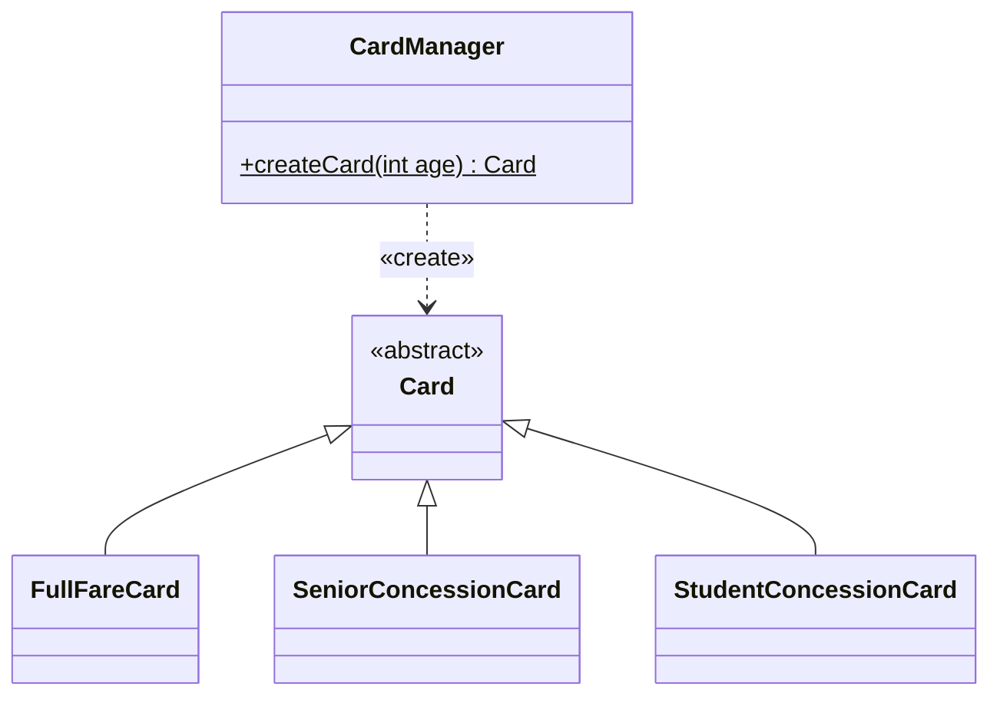

# [[Factory Method Pattern (Java)]]

**Context:** [[FIT2099_MOC]] · a **creational** design pattern (GoF) · centralise object creation so callers get the right subclass without an `if/instanceof` ladder · upholds [[Open-Closed Principle (Java)|OCP]] and [[Three Core Design Principles (Java)|DRY]]
**Task signature:** creating one of several subclasses depending on some input, without scattering the selection logic across the codebase.

> [!abstract] Quick Revision
> - **🎯 Trigger:** the same "which subclass do I build?" decision is repeated (or would be) in many places ➔ move it into one **factory method**.
> - **⚡ Critical Bottleneck:** the factory returns the **parent type** (`Card`), deciding the concrete subclass internally — callers never name the subclass, so adding a new one touches only the factory.

## 🔧 Minimal Working Example
```java
abstract class Card {}
class FullFareCard extends Card {}
class SeniorConcessionCard extends Card {}
class StudentConcessionCard extends Card {}

class CardManager {
    static Card createCard(int age) {          // factory method: returns the PARENT type
        if (age > 65)      return new SeniorConcessionCard();
        else if (age < 18) return new StudentConcessionCard();
        else               return new FullFareCard();
    }
}
// caller:
Card card = CardManager.createCard(age);       // gets the right Card, doesn't know which subclass
```
**Expected output:** one `createCard` call yields the correct `Card` subtype for the age; the selection logic lives in **one** place.

- **Returns the abstraction** ➔ the method's return type is the base class/interface, so callers depend only on `Card`.
- **Centralised decision** ➔ the subclass choice sits inside the factory, not duplicated across clients (**DRY**).
- **Static or instance** ➔ often a `static` method on a manager/factory class.

## ⚙️ classDiagram

*(`$` marks `createCard` static; `CardManager` depends on `Card` and instantiates a concrete subclass.)*

## 🥋 Kata
> [!QUESTION]- Kata 1: Shapes are created from a code: `"C"`→Circle, `"S"`→Square, else Unknown. Write a `ShapeFactory.create(String code)` returning a `Shape`.
> > [!SUCCESS]- Reference solution
> > ```java
> > abstract class Shape {}
> > class Circle extends Shape {}
> > class Square extends Shape {}
> > class Unknown extends Shape {}
> > class ShapeFactory {
> >     static Shape create(String code) {
> >         switch (code) {
> >             case "C": return new Circle();
> >             case "S": return new Square();
> >             default:  return new Unknown();
> >         }
> >     }
> > }
> > ```
> > - **Key move:** one factory owns the mapping and returns the base `Shape`; new shapes = one new `case`, no client edits.

## ⚠️ Pitfalls
- 💡 **Creational, not behavioural** ➔ the factory's job is *making* objects; don't stuff business logic into it beyond the selection.
- 💡 **Return the base type** ➔ returning a concrete subclass defeats the purpose — callers would re-couple to specifics.
- 💡 **Reduces `instanceof` sprawl** ➔ centralising creation supports [[Open-Closed Principle (Java)|OCP]]: a new subclass changes only the factory, not every caller.
