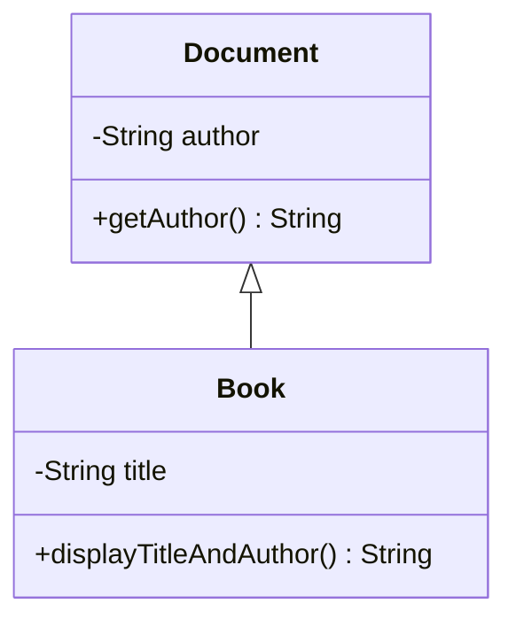

# [[Inheritance (Java)]]

**Context:** [[FIT2099_MOC]] · reuse a class's fields/methods in a more specific class · UML **generalisation** · basis for [[Polymorphism (Java)|polymorphism]] and [[Abstract Classes (Java)|abstract classes]] · an alternative axis of coupling to [[UML Associations and Dependencies (Java)|association]]
**Task signature:** a subclass **is-a** kind of a superclass — reuse the parent's members, add/override its own.

> [!abstract] Quick Revision
> - **🎯 Trigger:** a class *is-a* specialisation of another (Book **is-a** Document, Car **is-a** Vehicle) ➔ **class Sub extends Super**.
> - **⚡ Critical Bottleneck:** a subclass **does not inherit constructors** and cannot see the superclass's **`private`** members — reach the parent via `super(...)` (constructor) and `super.method()` / `protected` (members).

## 🔧 Minimal Working Example
```java
public class Document {              // superclass
    private String author;
    public Document(String author) { this.author = author; }
    public String getAuthor() { return author; }
}

public class Book extends Document { // subclass: is-a Document
    private String title;
    public Book(String author, String title) {
        super(author);               // MUST call a superclass constructor first
        this.title = title;
    }
    public String displayTitleAndAuthor() {
        return this.title + " " + super.getAuthor();  // reuse parent via super/public getter
    }
}
```
**Expected output:** `new Book("Orwell","1984").displayTitleAndAuthor()` ➔ `"1984 Orwell"`.

- **`extends`** ➔ Book acquires Document's non-private fields and methods (reusability).
- **`super(author)`** ➔ calls the parent constructor; must be the **first statement** in the child constructor.
- **`super.getAuthor()`** ➔ reaches an inherited member; needed because `author` is `private` in Document.

## ⚙️ classDiagram

*(**Generalisation** (hollow triangle, `<|--`) = is-a: `Book` reuses `Document`'s members and adds its own. Reuse ↑, but couples `Book` to `Document`'s internals — keep the hierarchy shallow.)*

## 🔀 Variations
- **`super` for members** ➔ inside the subclass, `super.x` / `super.method()` refers to the immediate parent's version.
- **`protected` instead of getters** ➔ marking `author` [[Encapsulation and Access Modifiers (Java)|`protected`]] lets the subclass touch it directly — but **not recommended, especially for attributes** (leaks state).
- **Method overriding** ➔ redefine an inherited method with the **same signature** (name + params + return type):
```java
class Parent { public void display() { System.out.println("Parent"); } }
class Child extends Parent {
    @Override                                   // optional but recommended — compiler-checks the override
    public void display() {
        System.out.println("Child");
        super.display();                        // optionally still call the parent version
    }
}
```
- **`final` blocks inheritance** ➔ [[Static and Final (Java)|`final class`]] can't be extended; a `final` method can't be overridden.
- **Implicit constructor chaining** ➔ if a child constructor omits `super(...)`, Java inserts a call to the **no-arg** `super()`; a class with no constructor gets a default one that just calls `super()`.

## 🥋 Kata
> [!QUESTION]- Kata 1: `Vehicle` stores a `private int registration` set in its constructor. Write `Car extends Vehicle` adding a `private String brand`, whose constructor takes `(int rego, String brand)` and initialises both.
> > [!SUCCESS]- Reference solution
> > ```java
> > public class Vehicle {
> >     private int registration;
> >     public Vehicle(int rego) { this.registration = rego; }
> > }
> > public class Car extends Vehicle {
> >     private String brand;
> >     public Car(int rego, String brand) {
> >         super(rego);            // initialise the inherited part first
> >         this.brand = brand;
> >     }
> > }
> > ```
> > - **Key move:** `super(rego)` as the first line — the subclass **must** initialise the superclass part before its own.

> [!QUESTION]- Kata 2: `Parent.display()` is `protected`. Override it in `Child` so it prints the child message then the parent's. What is the tightest legal access modifier on the override?
> > [!SUCCESS]- Reference solution
> > ```java
> > class Child extends Parent {
> >     @Override
> >     public void display() {      // may widen protected -> public
> >         System.out.println("Child's display() method");
> >         super.display();
> >     }
> > }
> > ```
> > - **Key move:** an override may allow **more, but not less** access — `protected` → `public` is legal; `protected` → `private` will not compile.

## ⚠️ Pitfalls
- 💡 **Constructors are not inherited** ➔ the subclass must define its own and call `super(...)` first; forgetting it (when no no-arg parent constructor exists) is a compile error.
- 💡 **Overriding narrows access** ➔ an override may **widen** (`protected`→`public`) but **never narrow** (`public`→`protected`/`private`).
- 💡 **Signature mismatch = overload, not override** ➔ different params make a **new** method (overloading), silently not overriding; `@Override` catches this at compile time.
- 💡 **Can't see `private` parents** ➔ a subclass cannot access the superclass's `private` members — use a `public`/`protected` accessor or `super`.
- 💡 **Deep hierarchies leak state** ➔ chaining `GrandParent → Parent → Child → …` lets top-level `protected` attributes bleed down through every level, breaking encapsulation. Keep inheritance **as shallow as possible, as deep as necessary**; add [[Static and Final (Java)|`final`]] deliberately to cap further extension.
- 💡 **Single inheritance only** ➔ a Java class can `extend` **one** class (unlike C++'s multiple inheritance).
