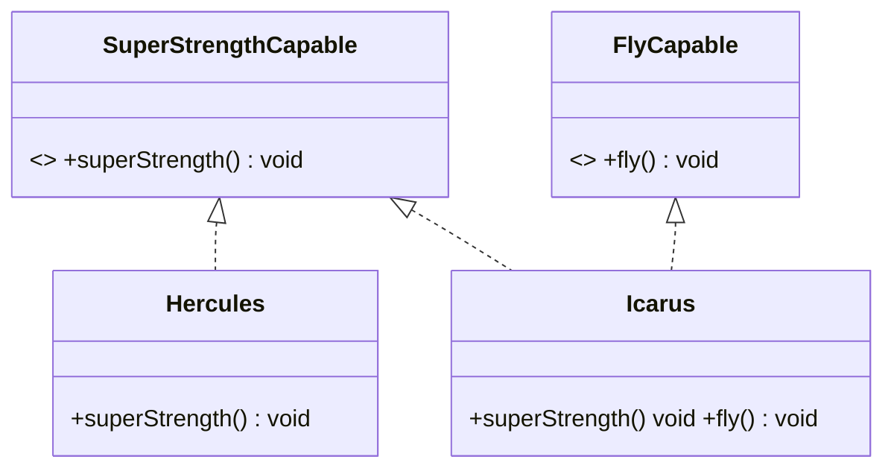

# [[Interface Segregation Principle (Java)]]

**Context:** [[SOLID Principles (Java)|SOLID]] · the **I** · keep [[Interfaces (Java)|interfaces]] small · feeds LSP (easier to honour) and SRP (focused classes)
**Task signature:** a fat interface forces implementers to stub methods they don't need — split it into small, single-capability interfaces.

> [!abstract] Quick Revision
> - **🎯 Trigger:** a class implements an interface but leaves methods **empty** (or throws an "unsupported operation" exception) ➔ the interface is too fat.
> - **⚡ Critical Bottleneck:** *clients should not be forced to depend on methods they don't use* — a class can implement **many** small interfaces, so there's no excuse for a bloated one.

## 🔧 Minimal Working Example
```java
// SMELL: one fat Hero interface forces empty implementations
public interface Hero { void superStrength(); void fly(); void shapeShift(); void leadArmy(); }
public class Hercules implements Hero {
    public void superStrength() { System.out.println("Hercules strikes!"); }
    public void fly() {}          // empty — Hercules can't fly
    public void shapeShift() {}   // empty
    public void leadArmy() {}     // empty
}

// FIX: segregate into one capability per interface
public interface SuperStrengthCapable { void superStrength(); }
public interface FlyCapable { void fly(); }
public class Hercules implements SuperStrengthCapable {
    public void superStrength() { System.out.println("Hercules uses Super Strength!"); }
}
```
**Expected output:** `Hercules` implements only what it can do; a flying-and-strong hero (Icarus) just implements **both** interfaces.

- **Interface pollution** ➔ a `Calculator` with `sin/cos/tan/log/sqrt` forces a kids' calculator to support functions it never needs ➔ split into `BasicCalc` + `AdvCalc`.
- **Each interface = one quality** ➔ e.g. standard `Comparable<T>` means "can be compared to a T" — nothing more.
- **Implement many** ➔ a class combines the exact capabilities it has.

## ⚙️ classDiagram (fat interface ➔ segregate)

*(**Realization** (dashed triangle, `<|..`): each class implements only the capabilities it truly has — no empty stubs. `Icarus` realizes both; `Hercules` just one ⇒ ↓ coupling to unused methods.)*

## 🥋 Kata
> [!QUESTION]- Kata 1: A `Machine` interface has `print()`, `scan()`, `fax()`. A simple printer must stub `scan()`/`fax()`. Refactor by ISP.
> > [!SUCCESS]- Reference solution
> > ```java
> > interface Printer { void print(); }
> > interface Scanner { void scan(); }
> > interface Fax     { void fax(); }
> > class SimplePrinter implements Printer { public void print() { /* ... */ } }
> > class AllInOne implements Printer, Scanner, Fax { /* implements all three */ }
> > ```
> > - **Key move:** split by capability; each class implements only the interfaces it truly supports.

## ⚠️ Pitfalls
- 💡 **Empty method body = ISP violation** ➔ stubbing methods "to satisfy the interface" is the tell-tale smell (also a latent [[Liskov Substitution Principle (Java)|LSP]] break).
- 💡 **Don't over-split either** ➔ an interface per single method can be excessive; each should represent **one coherent quality**.
- 💡 **ISP → LSP → SRP chain** ➔ small interfaces are easier to fully substitute (LSP) and lead to focused, single-purpose classes (SRP).
