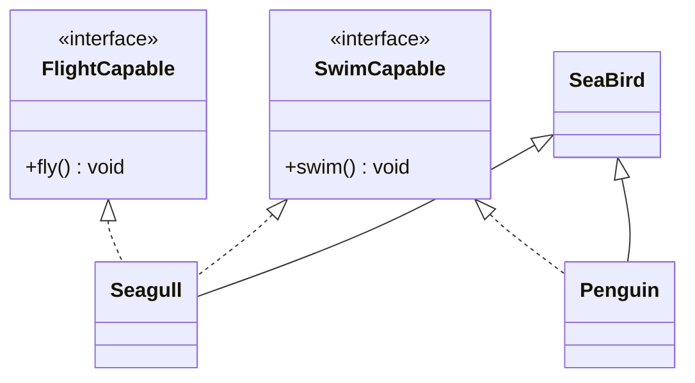

# [[Interfaces (Java)]]

**Context:** [[FIT2099_MOC]] · a **pure** contract — a capability a class promises to provide · escapes single-inheritance to enable [[Polymorphism (Java)|polymorphism]] across unrelated classes
**Task signature:** declare *what* a class must be able to do (fly, swim, compare) without dictating *how*, and let any class opt in.

> [!abstract] Quick Revision
> - **🎯 Trigger:** you need a **capability** many unrelated classes can share (or a class needs "more than one type") ➔ define an interface and **implement** it.
> - **⚡ Critical Bottleneck:** a class `extends` **one** class but `implements` **many** interfaces — this is Java's answer to multiple inheritance (of *type*, not state); every abstract interface method **must** be implemented.

## 🔧 Minimal Working Example
```java
interface SwimCapable { public void swim(); }        // pure blueprint: signature, no body
interface FlightCapable { public void fly(); }

class Penguin extends SeaBird implements SwimCapable {   // extends ONE class, implements interface
    public void swim() { System.out.println("The penguin can swim"); }  // body supplied here
}
class Seagull extends SeaBird implements SwimCapable, FlightCapable {    // many interfaces, comma-separated
    public void swim() { System.out.println("The Seagull can swim"); }
    public void fly()  { System.out.println("The Seagull can fly"); }
}
```
**Expected output:** `new Seagull().fly()` ➔ `The Seagull can fly`; the implementing class provides every method body.

- **`implements`** ➔ (not `extends`) binds a class to an interface's contract.
- **Multiple interfaces** ➔ list them comma-separated after `implements`; combine with a single `extends`.
- **Pure abstraction** ➔ interface methods are `public` + `abstract` by default (no body); a class that skips one won't compile.

## ⚙️ classDiagram

*(`<|..` dashed = **realization** — a class implementing an interface; solid `<|--` = class inheritance.)*

## 🔀 Variations — interface vs abstract vs concrete
| | Interface | Abstract class | Concrete class |
| :--- | :---: | :---: | :---: |
| **Constructor** | ✘ | ✔ | ✔ |
| **static/final attrs** | ✔ | ✔ | ✔ |
| **instance (non-final) attrs** | ✘ | ✔ | ✔ |
| **private/protected members** | ✘ | ✔ | ✔ |
| **abstract methods** | ✔ | ✔ | ✘ |
| **default methods** | ✔ (Java 8+) | ✘ | ✘ |
| **multiple inheritance** | ✔ | ✘ | ✘ |

- **Default method** ➔ (Java 8+) `default void show() { ... }` gives an interface a *concrete* method, adding functionality **without breaking** existing implementers (aka "defender" / "virtual extension" method).

## 🥋 Kata
> [!QUESTION]- Kata 1: Define a `Comparable`-style interface `Rankable` with `int rank()`. Make `Player` implement it. Why prefer an interface here over extending a `Rankable` base class?
> > [!SUCCESS]- Reference solution
> > ```java
> > interface Rankable { int rank(); }
> > class Player extends Character implements Rankable {
> >     private int score;
> >     Player(int score) { this.score = score; }
> >     public int rank() { return score; }
> > }
> > ```
> > - **Key move:** `Player` already `extends Character`; an interface adds the `Rankable` capability **without** consuming its single `extends` slot.

## ⚠️ Pitfalls
- 💡 **`implements` vs `extends`** ➔ classes `implement` interfaces; an interface can itself `extend` other interfaces — mixing the keywords won't compile.
- 💡 **No instance state** ➔ interfaces can't hold ordinary (non-static, non-final) attributes or constructors — they're contracts, not objects.
- 💡 **Why interfaces** ➔ abstraction + runtime dynamic dispatch + **loose coupling**: they separate a method's *definition* from the inheritance hierarchy, so unrelated classes share a type.
