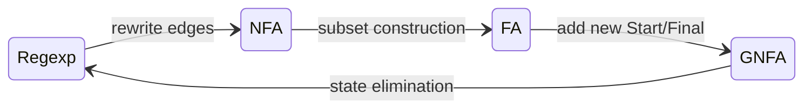

# [[Kleene's Theorem]]

**Context:** [[FIT2014_MOC]] · the theorem that **regular expressions and finite automata describe exactly the same languages** · the hub for the three conversion procedures

> [!abstract] Quick Revision
> - **🎯 Objective:** any language definable by a **regular expression**, **FA**, **NFA** or **GNFA** can be defined by **any of the others** ➔ all four formalisms have identical expressive power.
> - **⚡ Critical Bottleneck:** the proof is **constructive** — it is a **cycle** of conversions, and each leg is a examinable hand procedure.

## 📝 The theorem
**Theorem (Kleene).** Any language which can be defined by
- a **Regular Expression**, · a **Finite Automaton (FA/DFA)**, · a **Nondeterministic Finite Automaton (NFA)**, · a **Generalised NFA (GNFA)**

can be defined by **any of the other methods**.

- **Consequence** ➔ "**regular language**" is a robust notion: it does not matter which of the four you use to define it.
- **GNFA** ➔ an NFA whose transitions may be labelled by **regular expressions** rather than single letters — the bridge used to get back from automata to expressions.

## 🔁 The conversion cycle

| Leg | Procedure | Note |
| :--- | :--- | :--- |
| Regexp $\to$ NFA | rewrite each edge until every label is a letter or $\varepsilon$ | [[Converting Regular Expressions to NFA]] |
| NFA $\to$ FA | **subset construction** (sets of NFA states become FA states) | [[NFA to DFA (Subset Construction)]] |
| FA $\to$ GNFA | add a fresh single Start and single Final state joined by $\varepsilon$ | [[FA to Regular Expression (GNFA State Elimination)]] |
| GNFA $\to$ Regexp | **state elimination**, one state at a time | same note |

- **Why a cycle** ➔ going all the way round shows each formalism can simulate the next, so all four are equivalent. Any two are connected by following the arrows.

## ❓ What Kleene's Theorem does *not* settle
- **Answered YES** ➔ every regex language has an FA; every FA language has a regex. The two circles **coincide**.
- **Now answered** ➔ *can **every** language be represented by a regular expression or finite automaton?* — **No**, on two independent grounds:
  - **Counting** ➔ there are **uncountably many** languages but only countably many expressions/automata ([[Countability and Cantor Diagonalisation]]).
  - **Concretely** ➔ the [[Pumping Lemma for Regular Languages|pumping lemma]] exhibits **named** non-regular languages — HALF-AND-HALF $\{\mathtt{a}^{n}\mathtt{b}^{n}\}$, EQUAL and PALINDROME (see [[Proving a Language Non-Regular]]).
- **The final picture** ➔ $\{\text{regular languages}\}$ is a **proper subset** of $\{\text{all languages}\}$.

## ⚠️ Pitfalls
- 💡 **Equivalence is about the language, not the machine** ➔ converting changes size and shape drastically (an $n$-state NFA can need $2^{n}$ DFA states); only the **set of accepted strings** is preserved.
- 💡 **"Regular" ≠ "any language"** ➔ Kleene's Theorem says the four formalisms agree with each other, **not** that they cover everything.
- 💡 **GNFA is a proof device** ➔ it exists to make the FA $\to$ regex direction tractable; it is not a separate model you would design from scratch.

## 🧠 Active Recall
> [!FAQ]- What does Kleene's Theorem assert, and why is the proof arranged as a cycle?
> > [!SUCCESS]- Answer
> > - **Direct Criterion:** it asserts that regular expressions, FAs, NFAs and GNFAs all define **exactly the same class of languages**. The proof is **constructive**: Regexp $\to$ NFA $\to$ FA $\to$ GNFA $\to$ Regexp.
> > - **Technical Justification:** **Closing the loop proves mutual simulation** ➔ each arrow converts one formalism into the next while preserving the language, so following the cycle from any starting point reaches every other formalism — establishing equivalence in all directions at once.

> [!FAQ]- After Kleene's Theorem, which of the three opening questions remains unanswered, and how is it eventually resolved?
> > [!SUCCESS]- Answer
> > - **Direct Criterion:** the first two ("can every regex language be given an FA?" and "can every FA language be given a regex?") are answered **YES**. The third — "can **every** language be represented this way?" — remains open, and the answer is **no**.
> > - **Technical Justification:** **Cardinality plus concrete witnesses** ➔ languages are uncountable while descriptions are countable ([[Countability and Cantor Diagonalisation]]), so most languages are unreachable; the pumping lemma later names specific non-regular languages.
