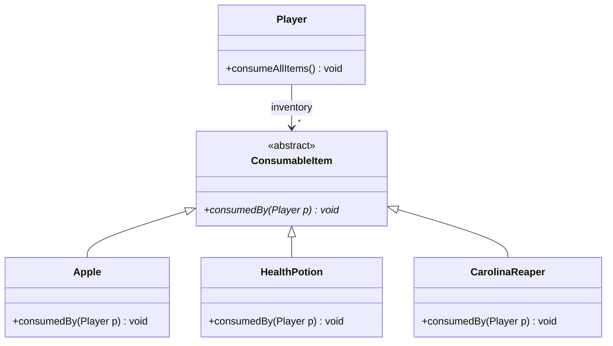

# [[Open-Closed Principle (Java)]]

**Context:** [[SOLID Principles (Java)|SOLID]] · the **O** · add features by writing new classes, not editing old ones · powered by [[Abstract Classes (Java)|abstraction]] + [[Polymorphism (Java)|polymorphism]]
**Task signature:** a growing `if/instanceof` ladder that you edit every time a new type is added — replace it with polymorphic dispatch.

> [!abstract] Quick Revision
> - **🎯 Trigger:** you must **edit existing code** to add a new case ➔ violates OCP; push the behaviour behind an abstract method.
> - **⚡ Critical Bottleneck:** "closed for modification" means the *existing, tested* class shouldn't change; "open for extension" means new behaviour arrives as **new subclasses**.

## 🔧 Minimal Working Example
```java
// SMELL: Player.consumeAllItems edits an if-ladder for every new item type
public void consumeAllItems() {
    for (ConsumableItem item : inventory) {
        if (item instanceof Apple)             healthPoint += 50;
        else if (item instanceof HealthPotion) healthPoint += 1000;
        else if (item instanceof CarolinaReaper) healthPoint -= 500;   // add Burger? edit here again
    }
}

// FIX: let each item know how it affects the player
public abstract class ConsumableItem { public abstract void consumedBy(Player player); }
public class HealthPotion extends ConsumableItem {
    @Override public void consumedBy(Player p) { p.setHealthPoint(p.getHealthPoint() + 1000); }
}
// Player no longer changes:
public void consumeAllItems() {
    for (ConsumableItem item : inventory) item.consumedBy(this);   // polymorphic dispatch
}
```
**Expected output:** adding `Burger`/`Potato` = **new class only**; `Player` stays untouched.

- **Abstraction is the hinge** ➔ an abstract method (or interface) defines the extension point.
- **New type = new class** ➔ implement the method; no edit to the consuming loop.
- **Kills the `instanceof` ladder** ➔ dispatch replaces conditional type checks.

## ⚙️ classDiagram


## 🥋 Kata 
> [!QUESTION]- Kata 1: A `Renderer` has `if (shape instanceof Circle) ... else if (shape instanceof Square) ...` to compute area. Refactor to obey OCP.
> > [!SUCCESS]- Reference solution
> > ```java
> > abstract class Shape { abstract double area(); }
> > class Circle extends Shape { double r; double area() { return Math.PI*r*r; } }
> > class Square extends Shape { double s; double area() { return s*s; } }
> > // Renderer never changes:
> > double total(Shape[] shapes) { double t=0; for (Shape s: shapes) t += s.area(); return t; }
> > ```
> > - **Key move:** move behaviour onto the type; the consumer calls one polymorphic method.

## ⚠️ Pitfalls
- 💡 **Extending at the cost of modifying** ➔ if adding a feature forces edits to a tested class, OCP is broken — even if it "works".
- 💡 **Don't over-abstract** ➔ too many abstract layers "for future-proofing" adds complexity; abstract the axis that actually varies.
- 💡 **OCP ↔ `instanceof`** ➔ a growing `instanceof` chain is the classic OCP (and [[Liskov Substitution Principle (Java)|LSP]]) smell.
