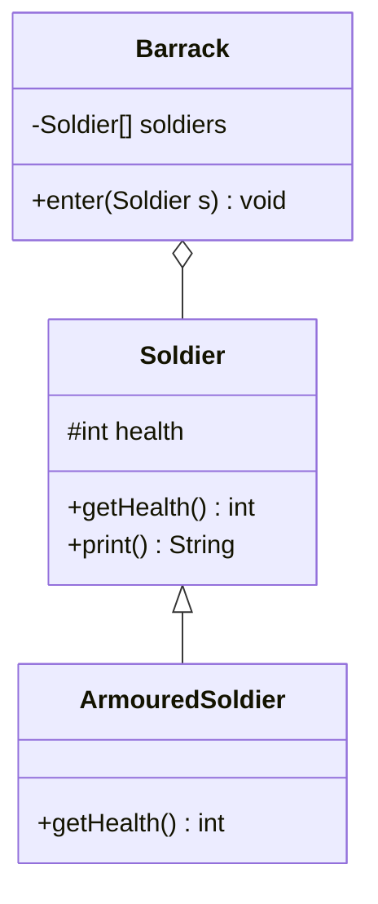

# [[Polymorphism (Java)]]

**Context:** [[FIT2099_MOC]] · treat many [[Inheritance (Java)|subclasses]] through one supertype · "one interface, many implementations" · the payoff of inheritance/[[Abstract Classes (Java)|abstraction]]
**Task signature:** write code against a base type and let each concrete subclass supply its own behaviour at runtime.

> [!abstract] Quick Revision
> - **🎯 Trigger:** you want one action to behave differently per subclass ➔ call an **overridden** method through a **base-type** reference.
> - **⚡ Critical Bottleneck:** the **runtime object type** (not the declared variable type) decides which overridden method runs; but a base-type variable can only see the **base type's** methods — subclass-only methods are hidden.

## 🔧 Minimal Working Example
```java
class Soldier {
    protected int health;
    Soldier(int health) { this.health = health; }
    public int getHealth() { return health; }
    public String print() { return "Soldier (" + getHealth() + " HP)"; }
}
class ArmouredSoldier extends Soldier {
    ArmouredSoldier(int health) { super(health); }
    @Override public int getHealth() { return super.getHealth() * 2; }  // doubled
}

Soldier a = new Soldier(50);
Soldier b = new ArmouredSoldier(50);   // upcast: declared Soldier, actual ArmouredSoldier
System.out.println(a.print());          // Soldier (50 HP)
System.out.println(b.print());          // Soldier (100 HP)  <- overridden getHealth() runs
```
**Expected output:** `Soldier (50 HP)` then `Soldier (100 HP)` — `print()` is inherited unchanged, but it calls the **overridden** `getHealth()`.

- **Upcasting** ➔ `Soldier b = new ArmouredSoldier(...)` — a subclass instance stored in a base-type variable.
- **Dynamic dispatch** ➔ `b.print()` calls `getHealth()`, and the **actual** object's override wins at runtime.
- **Needs inheritance** ➔ polymorphism only exists where a subclass overrides a supertype method.

## ⚙️ classDiagram

*(`Barrack` aggregates the **base type** `Soldier` only, so any subclass slots in with **no edit** (↓ coupling, ↑ extensibility); dynamic dispatch runs `ArmouredSoldier.getHealth()` at runtime.)*

## 🔀 Variations
- **Polymorphic container** ➔ store mixed subclasses under the base type:
```java
class Barrack {
    Soldier[] soldiers = new Soldier[10];
    int index = 0;
    void enter(Soldier s) { soldiers[index++] = s; }   // accepts ANY Soldier subtype
}
```
- **Abstract supertype** ➔ the base is often an [[Abstract Classes (Java)|abstract class]]: `Assessment a = new Test();` — you code to `Assessment`, each subclass implements `mark()`.

## 🥋 Kata 
> [!QUESTION]- Kata 1: A `Shape` has `area()` returning `0`. `Circle` (radius r) overrides it to `πr²`. Store a `Circle` in a `Shape` variable and print its area. Why does the override run?
> > [!SUCCESS]- Reference solution
> > ```java
> > class Shape { public double area() { return 0; } }
> > class Circle extends Shape {
> >     private double r;
> >     Circle(double r) { this.r = r; }
> >     @Override public double area() { return Math.PI * r * r; }
> > }
> > Shape s = new Circle(2);          // upcast
> > System.out.println(s.area());     // ~12.566, not 0
> > ```
> > - **Key move:** dispatch is on the **runtime type** (`Circle`), so `Circle.area()` runs even though the variable is declared `Shape`.

## ⚠️ Pitfalls
- 💡 **Base variable hides subclass methods** ➔ if `ArmouredSoldier` adds `releaseArmour()`, a `Soldier`-typed variable **cannot** call it — declare it as `ArmouredSoldier` (or downcast) to reach subclass-only members.
- 💡 **Override, not overload** ➔ dynamic dispatch needs the **same signature**; a different parameter list is overloading and won't be chosen polymorphically.
- 💡 **Coupling win** ➔ `Barrack` depends only on `Soldier`, so new subclasses slot in with **no edit** — this is the extensibility payoff of polymorphism.
