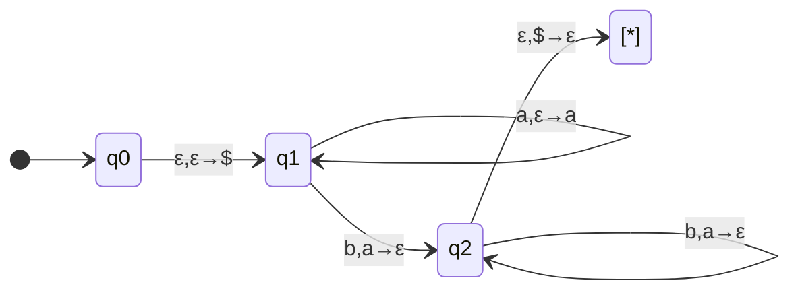

# [[Pushdown Automata (PDA)]]

**Context:** [[FIT2014_MOC]] · **NFA + a stack** — the machine model for context-free languages · the recognising counterpart to the generating [[Context-Free Grammars (CFG)|CFG]]

> [!abstract] Quick Revision
> - **🎯 Objective:** a [[Finite Automata (DFA and NFA)|nondeterministic finite automaton]] equipped with an **unbounded stack** ➔ the stack is the extra memory that lets it **count/match**, so PDAs recognise **exactly the context-free languages**.
> - **⚡ Critical Bottleneck:** a transition $x,y\to z$ reads $x$ from the tape, **pops $y$**, and **pushes $z$** — any of $x,y,z$ may be $\varepsilon$ (read nothing / pop nothing / push nothing). Only the **top** of the stack is ever visible.

## 📝 What a PDA is
A pushdown automaton consists of:
- an **input alphabet** (tape letters), a **stack alphabet** (stack letters), a **stack**;
- a finite set of **states**, one **Start State**, some (maybe none) **Final States**;
- a set of **transitions** $x,y\to z$.

- **The stack** ➔ a last-in-first-out memory with two operations: **push** (put a letter on top) and **pop** (take the top letter off). Only the top is accessible.
- **Transition** $x,y\to z$ ➔ *while reading $x$, if $y$ is on top of the stack, replace it with $z$.*
  - $x=\varepsilon$ ➔ **no letter read** from the tape.
  - $y=\varepsilon$ ➔ **nothing popped**.
  - $z=\varepsilon$ ➔ **nothing pushed**.
- **Acceptance** ➔ a string is **accepted** if **some** path ends in a Final State (nondeterministic — like an NFA); **rejected** if **every** path crashes or ends non-Final.
- **The $\$$ marker** ➔ a fresh symbol pushed first ($\varepsilon,\varepsilon\to\$$) to mark the **bottom** of the stack, so the machine can detect "stack empty again" before accepting ($\varepsilon,\$\to\varepsilon$).

## 🧩 Worked PDA — HALF-AND-HALF $\{\mathtt{a}^{n}\mathtt{b}^{n}\}$

- **Idea** ➔ **push an $\mathtt{a}$ for every $\mathtt{a}$ read**, then **pop an $\mathtt{a}$ for every $\mathtt{b}$ read**; reaching $\$$ exactly as the input ends means the counts matched. The stack **is** the counter the pumping lemma said a finite automaton lacks.
- **Dyck / PARENTHESES** ➔ same shape: push on `(`, pop on `)`, accept when the stack returns to $\$$.

## ⚖️ PDA ⟺ CFG (the equivalence)
$$\{\text{context-free languages}\}\ =\ \{\text{languages recognised by a PDA}\}$$
Proved in **two containments**, both constructive:

| Direction | Construction idea |
| :--- | :--- |
| **CFG → PDA** (⊆) | Simulate a **leftmost** derivation: push $S$; repeatedly **expand** the top nonterminal by a production ($\varepsilon,X\to$ its right side) and **match** surfacing terminals against the input ($a,a\to\varepsilon$). Uses the [[Derivations and Parse Trees|prefix property]]. |
| **PDA → CFG** (⊇) | Normalise the PDA (one Final state, empty stack at accept, each move **either** pushes **or** pops). Introduce a nonterminal $A_{pq}$ = "strings that take the PDA from state $p$ to $q$, empty stack to empty stack"; the productions $A_{pq}\to A_{pr}A_{rq}$ and $A_{pq}\to xA_{p'q'}y$ mirror the two ways a computation returns to an empty stack. |

- **Consequence** ➔ the PDA is to CFLs what the FA is to regular languages — a machine characterisation of the grammar class.

## 📶 Where the PDA sits
- **An NFA is a PDA that never uses its stack** ➔ so **{regular languages} ⊆ {languages recognised by a PDA}**, matching {regular} ⊆ {CFL} from [[Regular Grammars and the CFL Hierarchy]].
- **Determinism** ➔ PDAs are **nondeterministic** in general; unlike finite automata, **deterministic** PDAs are strictly **weaker** than nondeterministic ones (not every CFL has a deterministic PDA).

## ⚠️ Pitfalls
- 💡 **Only the top of the stack is visible** ➔ a transition can inspect/replace **just** the top symbol; there is no random access into the stack.
- 💡 **Read the transition as read–pop–push** ➔ $x,y\to z$ does all three at once; blanking any component with $\varepsilon$ is the usual source of confusion.
- 💡 **Use the $\$$ bottom-marker** ➔ without it the PDA cannot tell "stack empty" from "more to pop", so it can't verify the counts balanced.
- 💡 **Acceptance is existential** ➔ like an NFA, one accepting path suffices; the machine may explore many nondeterministic paths.
- 💡 **Deterministic PDAs are weaker** ➔ do **not** assume you can always determinise a PDA the way you can an NFA — that equivalence fails at this level.

## 🧠 Active Recall
> [!FAQ]- What does a PDA add to an NFA, and why does that extra capability capture exactly the context-free languages?
> > [!SUCCESS]- Answer
> > - **Direct Criterion:** it adds an **unbounded stack** with push/pop. Because a transition can push a symbol per input letter and pop it later, the PDA can **match/count without bound** (e.g. push an $\mathtt{a}$ per $\mathtt{a}$, pop per $\mathtt{b}$), which finite automata cannot.
> > - **Technical Justification:** **Stack = the grammar's deferred suffix** ➔ the CFG→PDA construction runs a leftmost derivation with the unresolved suffix on the stack, and the PDA→CFG construction rebuilds a grammar from empty-stack-to-empty-stack computations — so the two models generate/recognise the **same** language class.

> [!FAQ]- Why is the $\$$ bottom-of-stack marker necessary in the HALF-AND-HALF PDA?
> > [!SUCCESS]- Answer
> > - **Direct Criterion:** after popping one $\mathtt{a}$ per $\mathtt{b}$, the machine must confirm the stack is **back to where it started** (all $\mathtt{a}$s matched) before accepting. The $\$$ pushed first is what it looks for: the transition $\varepsilon,\$\to\varepsilon$ to the Final state fires **only** when every $\mathtt{a}$ has been popped.
> > - **Technical Justification:** **Detecting "empty" needs a sentinel** ➔ a raw stack gives no signal distinguishing "empty" from "non-empty"; the marker turns "counts balanced" into a concrete, testable top-of-stack condition.
