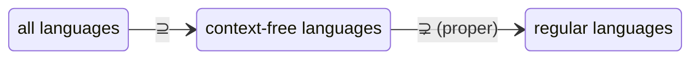

# [[Regular Grammars and the CFL Hierarchy]]

**Context:** [[FIT2014_MOC]] · the grammar that corresponds to a **finite automaton** · pins down exactly where the **regular** languages sit inside the **context-free** ones

> [!abstract] Quick Revision
> - **🎯 Objective:** a **regular grammar** is a CFG whose rules are restricted to a special shape ➔ it generates **exactly** the regular languages, so **{regular} ⊆ {CFL}**.
> - **⚡ Critical Bottleneck:** the containment is **proper**: EQUAL, HALF-AND-HALF, PALINDROME are context-free but **not** regular. Regular = "a nonterminal remembers only a *state*"; context-free = "a nonterminal can spawn *more* nonterminals" (unbounded memory).

## 📝 Regular grammars
- **Semiword** ➔ a string of the form $\text{terminal}\,\text{terminal}\dots\text{terminal}\ \text{Nonterminal}$ (some terminals then **one** nonterminal at the end).
- **Regular grammar** ➔ a CFG in which **every** production has one of the forms:
$$\text{Nonterminal}\to\text{semiword} \qquad\text{or}\qquad \text{Nonterminal}\to\text{string of terminals}$$
- **The restriction** ➔ at most **one** nonterminal on the right, and it must be **rightmost** — this is what keeps the memory finite (a nonterminal ≈ an automaton state).

## 🔧 Building a regular grammar from an NFA
Given an [[Finite Automata (DFA and NFA)|NFA]]:
1. **Name every state** by a nonterminal symbol; call the **Start State** $S$.
2. **For each transition** $X\xrightarrow{z}Y$ (arc labelled $z$ from state $X$ to $Y$), add the rule $X\to zY$.
3. **For each Final State** $X$, add the rule $X\to\varepsilon$.

- **Output** ➔ terminals = the NFA's alphabet; nonterminals = the states; rules as above — and this grammar is **regular** (every right side is a semiword or a terminal string).
- **Special edge forms** ➔ a self-loop $X\xrightarrow{z}X$ gives $X\to zX$; an $\varepsilon$-arc $X\xrightarrow{\varepsilon}Y$ gives $X\to Y$.

## 🎯 The two theorems (and the hierarchy)
- **Every regular language has a regular grammar** ➔ it is recognised by some NFA ([[Kleene's Theorem]]), and the construction above turns that NFA into a regular grammar. $\blacksquare$
- **Every regular grammar generates a regular language** ➔ (converse; proof left as exercise) — so **regular grammars ⟺ regular languages**.
- **Therefore** ➔ since every regular grammar **is** a CFG:
$$\{\text{regular languages}\}\ \subseteq\ \{\text{context-free languages}\}$$
- **Proper containment** ➔ the inclusion is **strict** — EQUAL / HALF-AND-HALF / PALINDROME are CFLs with **no** regular grammar (proved non-regular via the [[Pumping Lemma for Regular Languages|pumping lemma]]).

## ⚠️ Pitfalls
- 💡 **Regular grammar ≠ any grammar for a regular language** ➔ a regular *language* can be given a non-regular-**shaped** CFG; "regular grammar" is about the **rule form** (semiwords), not the language.
- 💡 **One rightmost nonterminal only** ➔ a rule like $A\to\mathtt{b}AA$ (two nonterminals) is **not** regular — it is what lifts EQUAL out of the regular class.
- 💡 **The NFA→grammar map needs the arc direction** ➔ $X\xrightarrow{z}Y$ gives $X\to zY$ (not $Y\to zX$); getting the direction wrong generates the reversed language.
- 💡 **Containment is proper, not equal** ➔ don't claim regular = context-free; the pumping lemma supplies explicit separating languages.

## 🧠 Active Recall
> [!FAQ]- What rule shape defines a regular grammar, and why does it force the language to be regular?
> > [!SUCCESS]- Answer
> > - **Direct Criterion:** every production is $\text{Nonterminal}\to\text{semiword}$ (terminals then **one rightmost** nonterminal) or $\text{Nonterminal}\to\text{terminals}$. With at most one nonterminal, always at the right end, a derivation is a **single growing prefix chasing one nonterminal**.
> > - **Technical Justification:** **Nonterminal ≈ automaton state** ➔ that single trailing nonterminal behaves exactly like the "current state" of an NFA; the NFA→grammar construction ($X\xrightarrow{z}Y \Rightarrow X\to zY$, Final $\Rightarrow X\to\varepsilon$) makes the correspondence explicit, so the generated language is recognised by a finite automaton.

> [!FAQ]- Justify that the regular languages form a *proper* subset of the context-free languages.
> > [!SUCCESS]- Answer
> > - **Direct Criterion:** **⊆** because every regular grammar is a CFG (so every regular language is context-free). **Proper** because HALF-AND-HALF $=\{\mathtt{a}^{n}\mathtt{b}^{n}\}$ has the CFG $S\to\mathtt{a}S\mathtt{b}\mid\varepsilon$ but is **non-regular** by the pumping lemma.
> > - **Technical Justification:** **Recursion beats finite state** ➔ context-free rules with multiple/embedded nonterminals give unbounded matched memory (counting $n$), which finite automata provably lack — so at least one CFL escapes the regular class, making the inclusion strict.
