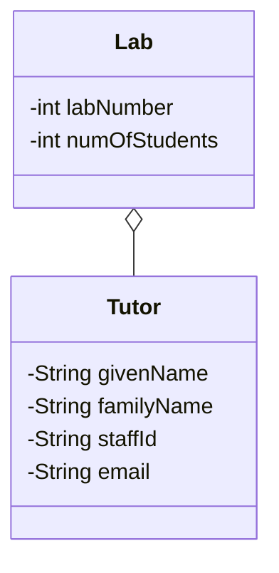

# [[Single Responsibility Principle (Java)]]

**Context:** [[SOLID Principles (Java)|SOLID]] · the **S** · "separation of concerns" made concrete · raises [[Three Core Design Principles (Java)|cohesion]]
**Task signature:** spot a class doing several unrelated jobs and split it so each class changes for exactly one reason.

> [!abstract] Quick Revision
> - **🎯 Trigger:** a class has methods/fields that change for **different reasons** ➔ split it, one responsibility per class.
> - **⚡ Critical Bottleneck:** the test is **"reason to change"**, not line count — *gather things that change for the same reason, separate those that change for different reasons* (Martin).

## 🔧 Minimal Working Example
```java
// SMELL: a God class — Tutor knows about lab, contact, and unit concerns
class Tutor {
    private String name, email; private int labNumber, numOfStudents; private String unitCode;
    void setLab(int labNumber, int n) { /* lab concern */ }
    void setUnitCode(String c) { /* unit concern + validation */ }
    // ...many unrelated reasons to change
}

// FIX: separate by reason-to-change
class Lab   { private Tutor[] tutors; private int labNumber, numOfStudents; }
class Tutor { private String givenName, familyName, staffId, email; }
```
**Expected output:** each class now has **one** reason to change; a lab-scheduling change touches `Lab`, a name-format change touches `Tutor`.

- **God class** ➔ one class holds all methods while others just carry data — procedural, not OO; many reasons to change.
- **Split trigger** ➔ two+ distinct behaviours, or changing one field cascades to unrelated features.
- **Scope** ➔ SRP applies to classes **and** methods **and** fields (name things precisely).

## ⚙️ classDiagram (God class ➔ split)

*(The `Tutor` God class splits by **reason to change**: lab-scheduling concerns → `Lab`, personal-detail concerns → `Tutor`. Each class now has one reason to change ⇒ ↑ **cohesion**.)*

## 🔀 Variations — reason-to-change
- **`Employee` example** ➔ `computePay()` (finance's concern) and `reportHours()` (operations' concern) change for different stakeholders ➔ belong in **different classes**.
- **Over-applying SRP** ➔ splitting until classes are trivially tiny **overcomplicates** the design; Martin targeted the common tendency to make classes *too large*, not to atomise everything.

## 🥋 Kata 
> [!QUESTION]- Kata 1: A `Report` class both computes figures and formats them as HTML. Name the two responsibilities and refactor into two classes.
> > [!SUCCESS]- Reference solution
> > ```java
> > class ReportCalculator { double[] compute() { /* numbers */ return new double[0]; } }
> > class ReportHtmlFormatter { String toHtml(double[] data) { return "<table>...</table>"; } }
> > ```
> > - **Key move:** calculation changes for *business-rule* reasons; formatting changes for *presentation* reasons — different reasons ⇒ different classes.

## ⚠️ Pitfalls
- 💡 **"One responsibility" ≠ "one method"** ➔ a class may have many methods **as long as they serve one reason to change**.
- 💡 **Measure with [[SOLID Principles (Java)|LCOM]]** ➔ a class whose methods split into field-clusters that don't overlap has low cohesion ➔ SRP candidate.
- 💡 **Cohesion payoff (Domain B)** ➔ good SRP means when a responsibility changes, everything you need is in one place and nothing extra gets in the way.
