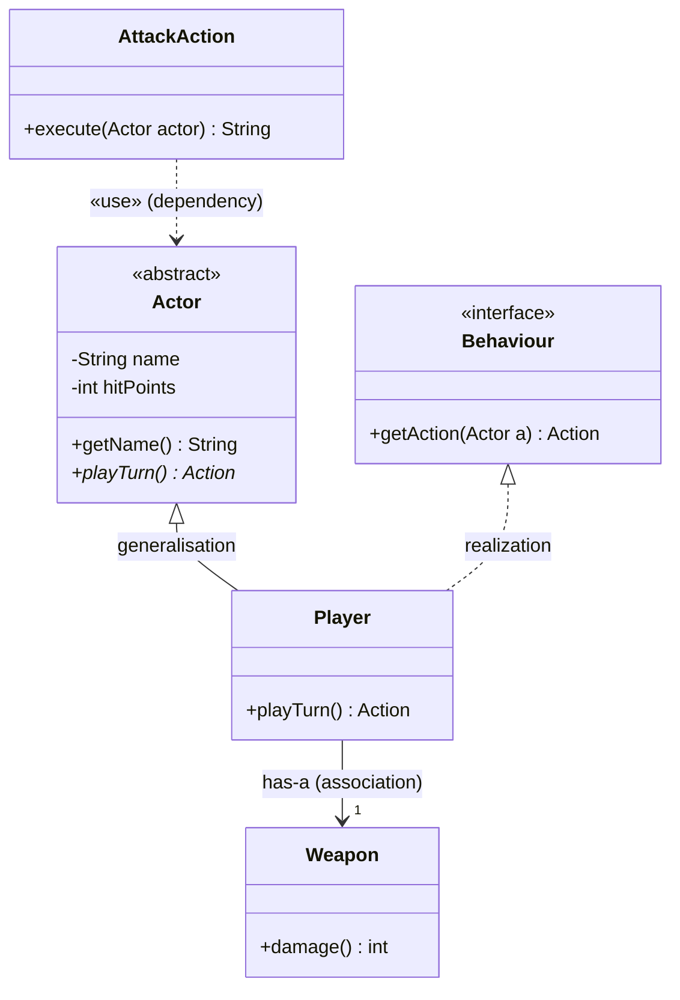

# [[UML Class Diagrams (Java)]]

**Context:** [[FIT2099_MOC]] · the **static** structure diagram (classes + relationships) · the consolidated notation reference for every `classDiagram` in the vault · the counterpart to the dynamic [[UML Sequence Diagrams (Java)|sequence diagram]]
**Task signature:** draw the classes of a design and the relationships between them, with correct arrows, visibility and multiplicity.

> [!abstract] Quick Revision
> - **🎯 Trigger:** you need to show the **structure** of a design — what classes exist and how they relate ➔ a class diagram (static), not a sequence diagram (dynamic).
> - **⚡ Critical Bottleneck:** the **arrow type encodes the relationship** — inheritance, realization, association and dependency are all different lines; getting the arrowhead/line-style wrong changes the meaning.

## 📦 The Class Box (three compartments)
```
┌───────────────────────────┐
│      «abstract» Actor     │  ← name (italic or «abstract»/«interface»/«enumeration» stereotype)
├───────────────────────────┤
│ - name : String           │  ← attributes: visibility name : Type
│ - hitPoints : int         │
├───────────────────────────┤
│ + getName() : String      │  ← methods: visibility name(param : Type) : ReturnType
│ + playTurn() : Action     │
└───────────────────────────┘
```
- **Visibility** ➔ `+` public · `-` private · `#` protected · `~` package/default (see [[Encapsulation and Access Modifiers (Java)|access modifiers]]).
- **Static** ➔ shown <u>underlined</u>. **Abstract** ➔ shown in *italics* (class name and/or method).
- **Stereotypes** ➔ `«interface»` ([[Interfaces (Java)|interface]]), `«abstract»` ([[Abstract Classes (Java)|abstract class]], or italic name), `«enumeration»` ([[Enumerations (Java)|enum]]).
- **No implementation** ➔ boxes show the interface (fields + signatures), never method bodies.

## 🔗 Relationship Arrow Legend (the core reference)
| Relationship | Line + head | Mermaid | Means | See |
| :--- | :--- | :--- | :--- | :--- |
| **Generalisation** (inheritance) | solid + hollow triangle | `Sup <\|-- Sub` | Sub **extends** Sup (is-a) | [[Inheritance (Java)]] |
| **Realization** (implements) | dashed + hollow triangle | `Int <\|.. Cls` | Cls **implements** interface Int | [[Interfaces (Java)]] |
| **Association** (has-a) | solid + open arrow | `A --> B` | A holds B as a **field** (stored) | [[UML Associations and Dependencies (Java)]] |
| **Dependency** (uses-a) | dashed + open arrow «use» | `A ..> B` | A uses B **transiently** (param/return) | [[UML Associations and Dependencies (Java)]] |
| **Aggregation** *(read-only)* | solid + hollow diamond | `Whole o-- Part` | whole–part, part can outlive whole | — |
| **Composition** *(read-only)* | solid + filled diamond | `Whole *-- Part` | whole **owns** part's lifetime | [[Client-Supplier Relationship (Java)]] |

- **Multiplicity** ➔ label the association end: `1`, `0..1`, `*` / `0..*`, `1..*`, `2` (exactly two).
- **FIT2099 scope** ➔ model with **generalisation, realization, association, dependency**; treat **aggregation/composition as read-only** (know them to read diagrams, not required to use).
- **Abstract method marker** ➔ in Mermaid, a trailing `*` on a method marks it abstract (`+playTurn()* Action`).

## ⚙️ Worked classDiagram (all four assessable arrows)

**Reads as:** `Player` **is-a** `Actor` (solid hollow triangle) and **implements** `Behaviour` (dashed hollow triangle); `Player` **has a** `Weapon` field (solid arrow, multiplicity 1); `AttackAction` **uses** an `Actor` only as a method parameter (dashed «use» arrow).

## 🥋 Kata 
> [!QUESTION]- Kata 1: `Enemy` is an abstract class; `Goblin` extends it. A `Dungeon` stores many `Enemy` objects. A `SpawnAction` receives an `Enemy` as a parameter but never stores it. Draw it — which arrow for each link?
> > [!SUCCESS]- Reference solution
> > ```mermaid
> > classDiagram
> >     class Enemy { <<abstract>> }
> >     class Goblin
> >     class Dungeon { +add(Enemy e) void }
> >     class SpawnAction { +execute(Enemy e) void }
> >     Enemy <|-- Goblin
> >     Dungeon --> "*" Enemy : has-a
> >     SpawnAction ..> Enemy : «use»
> > ```
> > - **Key move:** extends ⇒ `<|--`; **stored** many ⇒ association `-->` with `*`; **parameter-only** ⇒ dependency `..>`.

## ⚠️ Pitfalls
- 💡 **Wrong line style = wrong relationship** ➔ inheritance/realization use a **hollow triangle** (solid vs dashed line); association/dependency use an **open arrow** (solid vs dashed). Don't mix them.
- 💡 **Association vs dependency** ➔ stored **field** ⇒ association (`-->`); **method parameter/return/local** only ⇒ dependency (`..>`).
- 💡 **Class diagram ≠ sequence diagram** ➔ this shows **static structure** (types & relationships); runtime call order is the [[UML Sequence Diagrams (Java)|sequence diagram]]'s job. Abstractions **belong** here but **not** in a sequence diagram.
- 💡 **A diagram is a visual aid** ➔ for the [[Design Rationale (FIT2099)|rationale]], show only the classes/relationships relevant to the feature, not the whole system.
