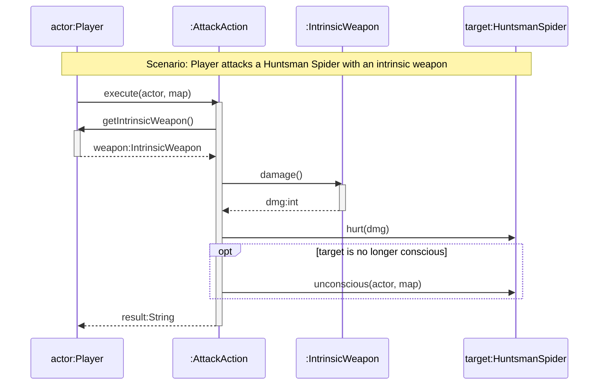

# [[UML Sequence Diagrams (Java)]]

**Context:** [[FIT2099_MOC]] · the **dynamic** counterpart to the static [[UML Associations and Dependencies (Java)|class diagram]] · shows the runtime order of method calls · a visual aid for the [[Design Rationale (FIT2099)|design rationale]] / Assignment
**Task signature:** model *how objects interact over time* for one specific scenario — who calls what, in what order, with what returns.

> [!abstract] Quick Revision
> - **🎯 Trigger:** you need to show the **chronological** flow of a method chain (A calls B calls C) at runtime ➔ draw a sequence diagram (an **interaction** diagram).
> - **⚡ Critical Bottleneck:** objects are runtime instances, so use **concrete classes only** — never an abstract class or interface (they can't be instantiated); and scope to **one narrow scenario**, not every branch.

## 🔧 Minimal Working Example
*Scenario: a Player attacks a Huntsman Spider with an intrinsic weapon (concrete classes only).*

**Expected output:** a top-to-bottom trace of the attack — `AttackAction` reads the weapon, gets its damage, applies it to the target, and (only if the target dropped) handles the death.

- **Solid arrow + solid head** ➔ a **synchronous** method call; the caller **waits** for the return. Open head = asynchronous (caller doesn't wait).
- **Dashed arrow + open head** ➔ a **return**, optionally labelled with the returned variable/type.
- **Activation bar** ➔ the thin rectangle on a lifeline = that object is **executing**; its length ≈ time taken.

## 📐 Notation Reference
| Element | How to draw it | Notes |
| :--- | :--- | :--- |
| **Object box** | `objectName:ClassName` | colon separates name and type; **no attributes** in the box |
| **Anonymous object** | `:ClassName` | can't be referenced elsewhere; **don't forget the colon** (common error) |
| **The class itself** | `«class» ClassName` | receives only **static** method calls |
| **Lifeline** | dashed vertical line under the box | the object's existence over time |
| **Message** | solid line, method name + params above | `aMethod(x:ClassA, y:ClassB):ClassC` |
| **Return** | dashed line, open head | label optional |
| **Reflexive (self) message** | arrow looping back to the **same** lifeline | object calls its own method |
| **Create object** | message arrow to a **new** box (dropped to creation time) | label with constructor `MaxCounter(int)` or `«create»` |
| **Delete object** | end the lifeline with an **X** | object destroyed |

- **Message signature rule** ➔ parameter **names are optional** (if shown, match the lifeline names); parameter **types and the return type are required**.

## 🔀 Fragments (control flow)
| Fragment | Java equivalent | Syntax |
| :--- | :--- | :--- |
| **`loop`** | `for` / `while` | frame labelled `loop` with a `[guard]` |
| **`alt`** | `if / else` / `switch` | one frame, sections split by a **horizontal dashed line**, each with a `[guard]` |
| **`opt`** | single `if` (no else) | one frame; body runs only if the `[guard]` is true |

- **Guard** ➔ the condition in **square brackets** `[amt <= balance]` on the left of the fragment.
- **Nesting** ➔ legal to nest (`opt` in `loop` in `alt`), but heavy nesting becomes **illegible** — for complex/recursive logic use **pseudocode** instead.

## 🥋 Kata 
> [!QUESTION]- Kata 1: A `:Bank` calls `withdraw(amt:int)` on `account:Account`. If `amt <= balance` the account returns `success` and sets its balance; otherwise it returns `failure`. Sketch it (which fragment?).
> > [!SUCCESS]- Reference solution
> > ```mermaid
> > sequenceDiagram
> >     participant B as :Bank
> >     participant A as account:Account
> >     B->>A: withdraw(amt:int)
> >     alt amt <= balance
> >         A->>A: setBalance(balance - amt)
> >         A-->>B: success
> >     else amt > balance
> >         A-->>B: failure
> >     end
> > ```
> > - **Key move:** two outcomes ➔ **`alt`** (not `opt`); the self-call `setBalance` is a **reflexive** message; guards go in `[...]`.

## ⚠️ Pitfalls
- 💡 **No abstractions in a sequence diagram** ➔ only concrete, instantiable classes (`AttackAction`, `Player`, `IntrinsicWeapon`) — never `Action`, `Actor`, or `Weapon` (abstract/interface).
- 💡 **Scope creep** ➔ don't cram every attack type (sword/bow/magic) into one diagram; fix a single scenario in a `Note` and model just that.
- 💡 **Sequence vs communication** ➔ both carry the **same** information; sequence diagrams read more easily (use these), communication diagrams number the calls and can be easier to draw by hand.
- 💡 **Formalise for the assignment** ➔ early/analysis diagrams may use plain-English messages; **Assignment 1** should approach final method signatures, and **Assignment 2** sequence diagrams must **match your code**.
